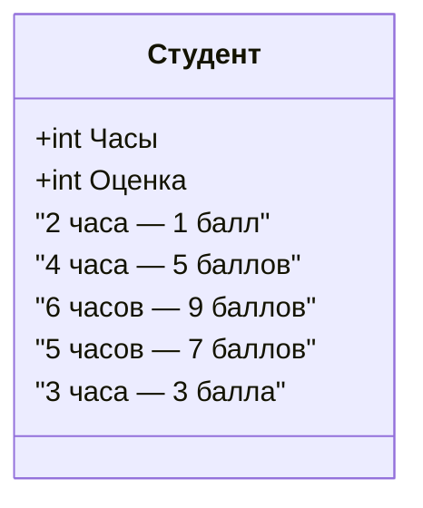
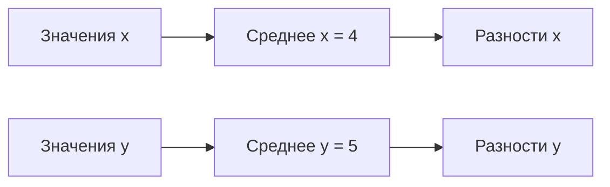
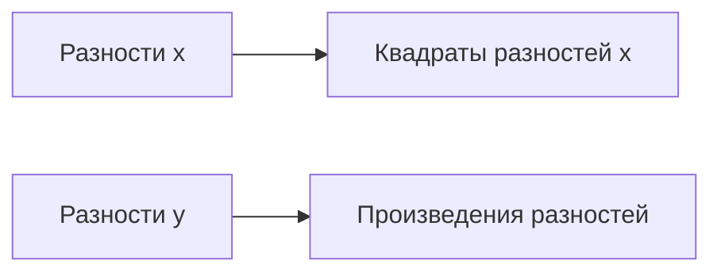
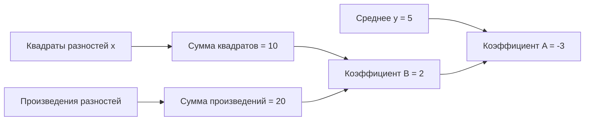

# Уравнение линейной регрессии

## Определение задачи

В данном разделе рассматривается метод поиска уравнения линейной регрессии для предсказания оценки студентов на основании количества часов, потраченных на подготовку к экзамену. Уравнение линейной регрессии имеет вид:

$y = A + Bx$

где $x$ — количество часов, потраченных на подготовку, а $y$ — оценка.

## Данные для анализа

Имеются следующие данные о подготовке студентов и их оценках:

## Вычисление средних значений

Для начала вычисляются средние значения для всех наблюдений из признака $x$ и для всех $y$:

- Среднее значение для $x$: $\frac{2 + 4 + 6 + 5 + 3}{5} = 4$.
- Среднее значение для $y$: $\frac{1 + 5 + 9 + 7 + 3}{5} = 5$.

## Поиск разностей

Далее вычисляются разности между значениями $x$ и средним значением для всех $x$, а также между значениями $y$ и средним значением для всех $y$:

- Разности для $x$: $2 - 4 = -2$, $4 - 4 = 0$, $6 - 4 = 2$, $5 - 4 = 1$, $3 - 4 = -1$.
- Разности для $y$: $1 - 5 = -4$, $5 - 5 = 0$, $9 - 5 = 4$, $7 - 5 = 2$, $3 - 5 = -2$.

## Вычисление квадратов разностей и произведений разностей

Затем вычисляются квадраты разностей для $x$ и произведения разностей:

- Квадраты разностей для $x$: $(-2)^2 = 4$, $0^2 = 0$, $2^2 = 4$, $1^2 = 1$, $(-1)^2 = 1$.
- Произведения разностей: $(-2) \cdot (-4) = 8$, $0 \cdot 0 = 0$, $2 \cdot 4 = 8$, $1 \cdot 2 = 2$, $(-1) \cdot (-2) = 2$.

## Нахождение коэффициентов уравнения

Теперь можно найти коэффициенты уравнения линейной регрессии:

- Коэффициент $B$: $\frac{8 + 0 + 8 + 2 + 2}{4 + 0 + 4 + 1 + 1} = \frac{20}{10} = 2$.
- Коэффициент $A$: $5 - 2 \cdot 4 = 5 - 8 = -3$.

## Итоговое уравнение

Таким образом, итоговое уравнение линейной регрессии имеет вид:

$y = -3 + 2x$

