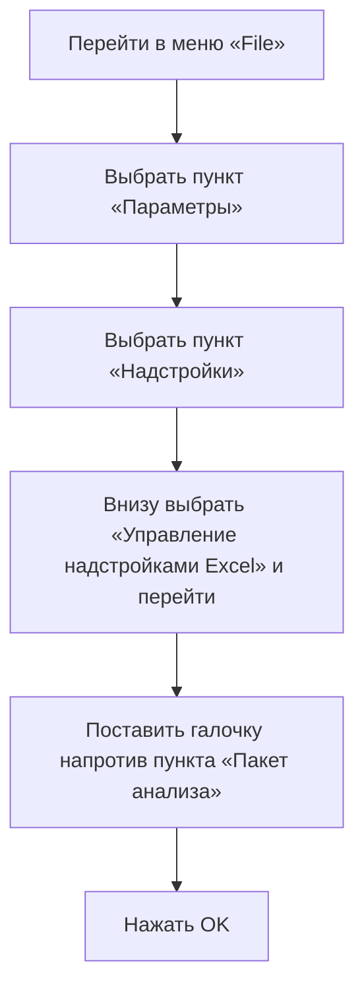
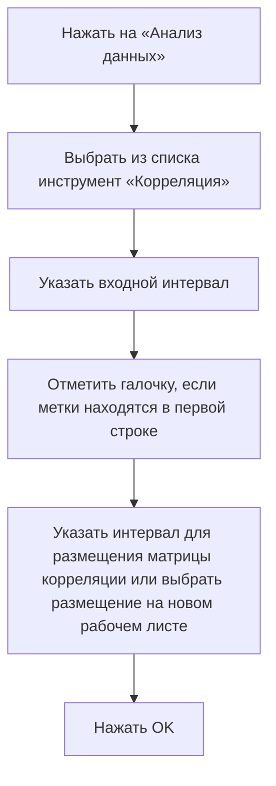

# Расчёт коэффициента корреляции в Excel

## Стандартная функция для расчёта коэффициента корреляции

В Excel существует стандартная функция для расчёта коэффициента корреляции — **CORREL**.

### Процесс использования функции CORREL

```mermaid
flowchart TD
    A[Ввести формулу =CORREL(] --> B[Выделить первый массив данных]
    B --> C[Поставить точку с запятой]
    C --> D[Выделить второй массив данных]
    D --> E[Закрыть скобку]
    E --> F[Нажать Enter]
```

**Пояснение:** На диаграмме показан пошаговый процесс использования функции CORREL для расчёта коэффициента корреляции в Excel.

## Матрица корреляции

Если необходимо найти коэффициенты корреляции для множества признаков, можно использовать надстройку для анализа данных в Excel.

### Подключение надстройки для анализа данных



**Пояснение:** Диаграмма иллюстрирует процесс подключения надстройки для анализа данных в Excel.

### Расчёт матрицы корреляции



**Пояснение:** На диаграмме показан процесс расчёта матрицы корреляции с использованием инструмента «Корреляция» в Excel.


## Вывод

В данном видео мы познакомились с тем, как рассчитать коэффициент корреляции с помощью стандартной функции Excel, а также как сразу рассчитать все коэффициенты корреляции для таблицы и построить матрицу корреляции с помощью специальной настройки для анализа данных.