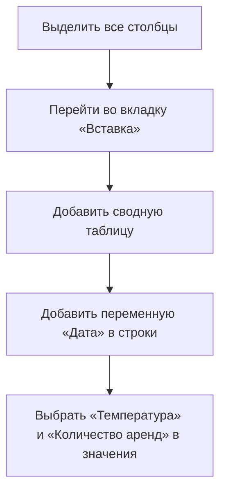
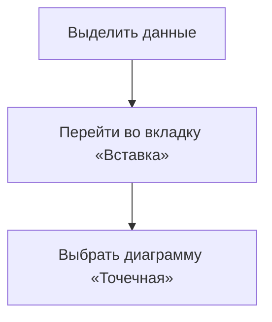

# Анализ зависимости количества аренд от температуры с использованием сводных таблиц и диаграмм в Excel

## Создание сводной таблицы

Для анализа зависимости количества аренд от температуры необходимо создать сводную таблицу. Процесс включает следующие шаги:

1. Выделите все столбцы.
2. Перейдите во вкладку «Вставка» и добавьте сводную таблицу.
3. Добавьте переменную «Дата» в строки.
4. В качестве значений выберите «Температура» и «Количество аренд».

### Настройка таблицы для построения диаграммы

После этого настройте таблицу:

- Нажмите правой клавишей на год и выберите пункт «Группировка».
- Группируйте по дням, убрав выделение с месяцев, кварталов и лет.
- Нажмите «ОК».

Теперь у вас есть значение для каждого дня, начиная с первого января. Однако, необходимо изменить параметры полей значений:

- Для температуры вычислите среднее значение.
- Для количества аренд измените параметры полей значений, чтобы было суммарное количество аренд.

Теперь для каждого дня есть средняя температура и суммарное количество аренд.

## Построение точечной диаграммы

По сводной таблице нельзя построить диаграмму, которая бы отображала зависимость количества аренд от средней температуры в нужном виде. Поэтому необходимо выделить полученные данные и скопировать их отдельно.

Такая диаграмма позволяет увидеть зависимость между средней температурой и количеством аренд.

### Добавление линейного тренда

Чтобы получить уравнение регрессии, описывающее зависимость суммы аренд от температуры, необходимо добавить линейный тренд:

1. Перейдите в «Добавить элемент диаграммы» и выберите «Линейный тренд».
2. Выберите «Линейный прогноз».

Появится линия, соответствующая уравнению регрессии.

### Получение уравнения регрессии

Чтобы получить само уравнение, нажмите правой клавишей на линию и выберите «Формат линейного тренда». В появившемся меню выберите пункт «Показывать уравнение на диаграмме» и поставьте галочку.

Уравнение будет иметь вид: $y = 600,90500x + 8,847,5$.

Подставляя вместо $x$ температуру, можно предсказать количество аренд. Однако такое предсказание будет не 100% точным.

