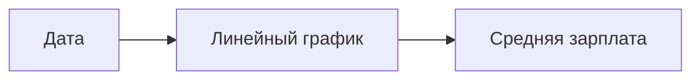

# Основные виды визуализации данных

## Виды графиков и их применение

### Линейный график

Линейный график хорошо подходит для отображения данных, связанных с временем. Он позволяет продемонстрировать тренды и количественные изменения. Например, можно показать, как средняя зарплата выпускников университета увеличивается с течением времени.

На линейном графике по оси X обычно откладываются даты, а по оси Y — переменная, которую мы хотим отследить (например, средняя зарплата).

Также на линейном графике можно сравнить несколько категорий. Например, можно сравнить зарплаты выпускников технических и социально-экономических специальностей.

### Гестограмма

Гестограмма используется для отображения распределения количественной переменной. Например, можно показать распределение зарплат выпускников в какой-то конкретный год.

В гестограмме каждый столбик представляет собой категорию, а высота столбика показывает, сколько наблюдений попало в эту категорию.

### Столбчатая диаграмма

Столбчатая диаграмма используется для сравнения категориальных переменных. Например, можно сравнить зарплаты выпускников разных университетов.

В столбчатой диаграмме всегда есть зазоры между столбиками, что отличает её от гестограммы.

### График рассеяния

График рассеяния используется для отображения зависимости между двумя переменными. Например, можно показать, как зависит зарплата выпускников от их опыта работы на рынке труда.

На графике рассеяния по оси X обычно откладывается одна переменная (например, годы работы на рынке труда), а по оси Y — другая переменная (например, зарплата).

График рассеяния можно модифицировать, добавив третью переменную, выраженную размером точки, или четвёртую переменную, выраженную цветом точки.

## Правила хорошей визуализации

При визуализации данных важно соблюдать следующие правила:

* подписывайте графики и оси;
* указывайте единицы измерения;
* оставляйте легенду к вашим данным;
* соблюдайте высокое отношение чернил к данным, т. е. каждый элемент на графике должен нести дополнительную информацию и делать график более удобным для чтения.