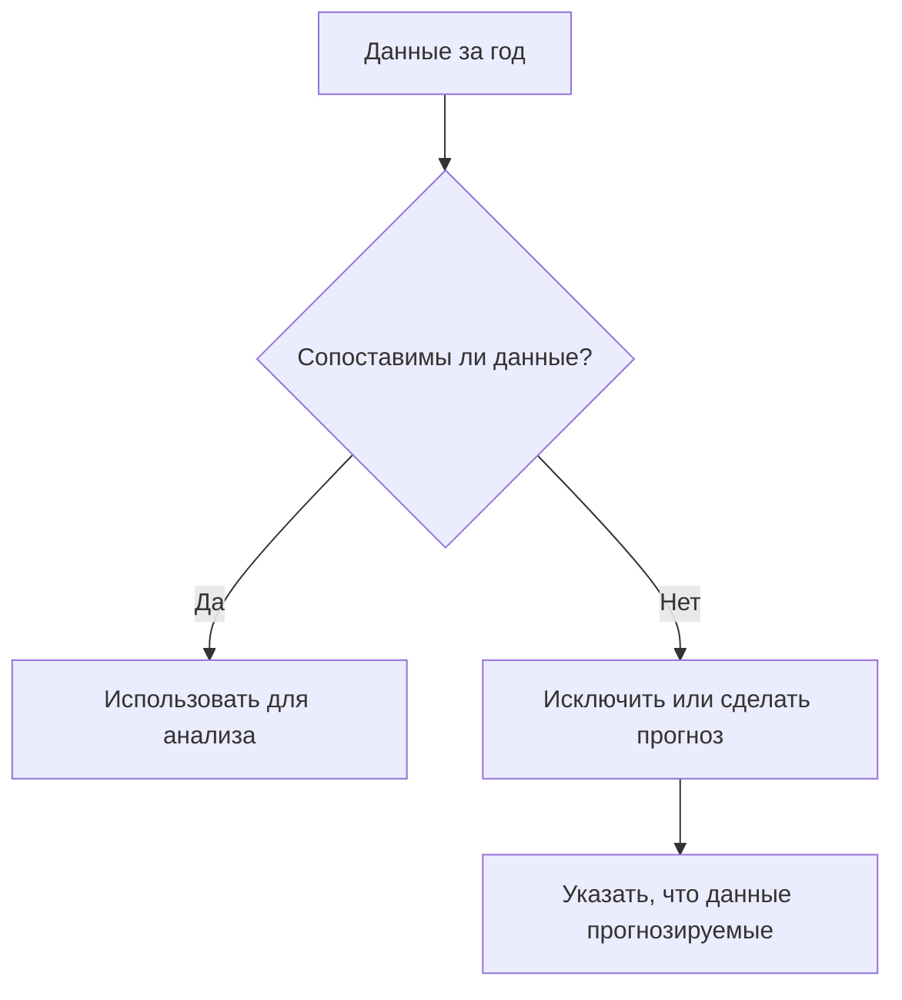
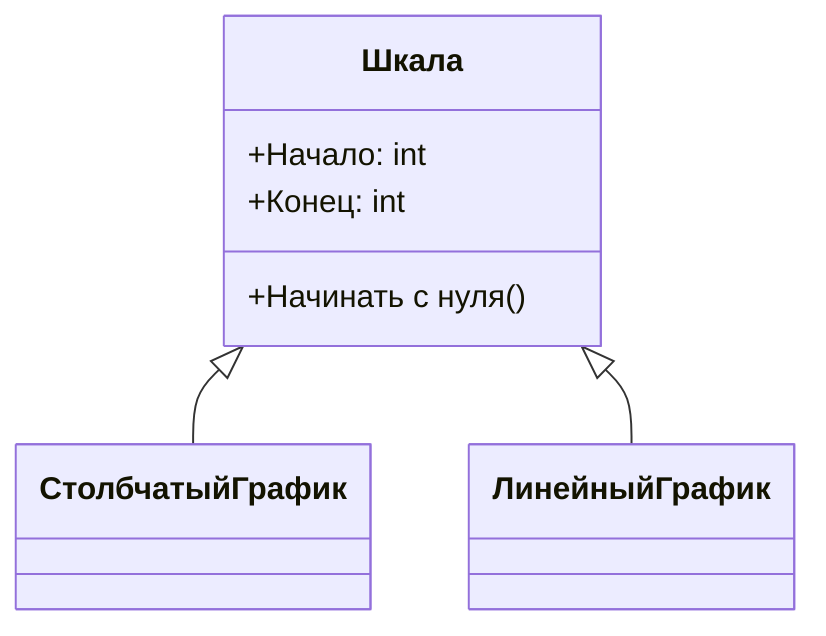

# Ошибки при перевизуализации данных и способы их избежать

## Неправильные данные для визуализации

При работе с данными для визуализации важно убедиться, что они корректны и сопоставимы. Например, если мы сравниваем данные за целые годы с данными за полугодие, это может привести к неверным выводам.

**Проблема:**
- Сравнение данных за разные периоды времени (например, год и полугодие) может создать ложное впечатление о трендах.

**Решения:**
1. Исключить неполные данные из анализа.
2. Если есть информация о распределении переменной в предыдущих периодах, можно сделать прогноз для неполных данных, указав, что это прогноз, а не реальные данные.




## Нарушение стартовой точки отсчёта

Ещё одна распространённая ошибка — начало шкалы не с нуля, что может преувеличить различия между данными.

**Проблема:**
- Начало шкалы не с нуля может создать впечатление более значительных изменений, чем есть на самом деле.

**Решение:**
- Всегда начинать шкалу с нуля, чтобы правильно отображать различия между данными. Это актуально для столбчатых и линейных графиков.



## Отсутствие контекста

Важно предоставлять данные в максимально широком контексте, чтобы избежать неверных интерпретаций.

**Проблема:**
- Ограниченный контекст может привести к неправильным выводам о причинах изменений данных.

**Решение:**
- Добавлять больше контекста, сравнивая данные с другими периодами или регионами, чтобы получить более полную картину.

### Пример

Рассмотрим данные о снижении аварийности на дорогах после ужесточения контроля за скоростью. Без учёта более широкого контекста сложно определить, является ли снижение аварийности результатом новых мер или частью естественного цикла.

**Возможные контексты:**
- Цикличность аварийности, связанная с погодными условиями.
- Аномальное повышение аварийности в определённый период.
- Влияние других факторов на аварийность.

Для более точной интерпретации данных необходимо учитывать эти и другие возможные контексты.

```mermaid
graph TD
    A[Снижение аварийности] --> B[Ужесточение контроля за скоростью]
    A --> C[Цикличность аварийности]
    A --> D[Аномальное повышение аварийности]
    A --> E[Другие факторы]
    B --> F[Вывод: Результат новых мер]
    C --> G[Вывод: Естественный цикл]
    D --> H[Вывод: Аномалия]
    E --> I[Вывод: Влияние других факторов]