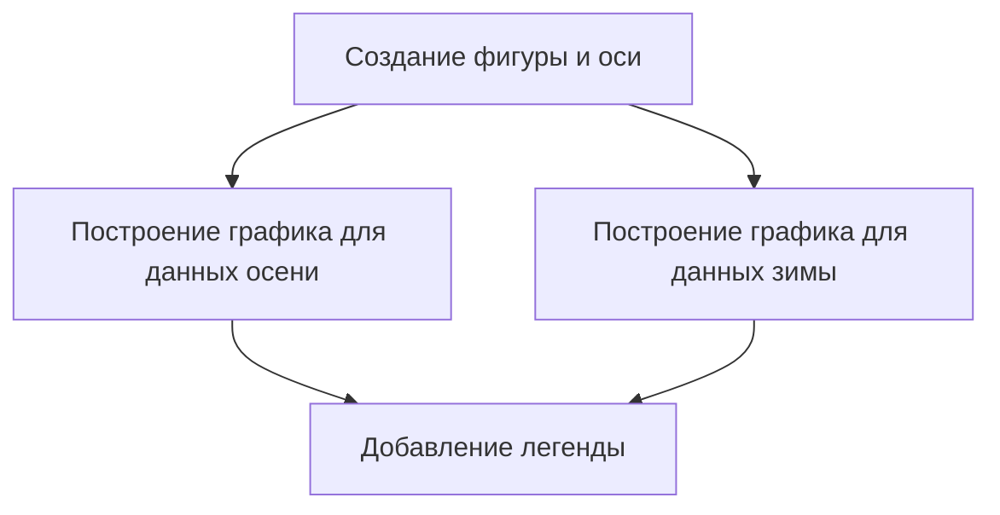

# Визуализация данных с использованием библиотеки Matplotlib

## Введение

В данной лекции рассматривается использование библиотеки **Matplotlib** для визуализации данных. Ранее уже были сделаны простые графики с помощью библиотеки **Pandas**, которая использует **Matplotlib** в качестве основы для своих графических возможностей.

## Подготовка среды

Для начала необходимо загрузить библиотеки **Pandas** и **Matplotlib**:

```python
import pandas as pd
import matplotlib.pyplot as plt
```

## Построение столбчатой диаграммы

### Агрегация данных

Для построения столбчатой диаграммы сначала агрегируем данные. Например, можно объединить данные по месяцам и найти среднюю температуру для каждого месяца:

```python
# Агрегируем данные по месяцам
aggregated_data = data.groupby(pd.Grouper(key='date', freq='M')).mean()
```

### Построение графика

Для построения графика используем функцию `bar` из библиотеки **Matplotlib**:

```python
plt.bar(aggregated_data.index, aggregated_data['temperature'])
```

### Настройка графика

Можно изменить цвет столбиков, используя параметр `color`:

```python
plt.bar(aggregated_data.index, aggregated_data['temperature'], color='orange')
```

## Построение линейного графика

### Агрегация данных

Объединим данные по неделям и найдем общее количество арендованных велосипедов для каждой недели:

```python
# Агрегируем данные по неделям
aggregated_data = data.groupby(pd.Grouper(key='date', freq='W')).sum()
```

### Построение графика

Используем функцию `plot` для построения линейного графика:

```python
plt.plot(aggregated_data.index, aggregated_data['bikes_rented'])
```

## Построение нескольких графиков на одной оси координат

Можно построить несколько наборов данных на одной оси координат, используя объект `ax`:

```python
fig, ax = plt.subplots()
ax.plot(aggregated_data_fall.index, aggregated_data_fall['bikes_rented'], label='Fall')
ax.plot(aggregated_data_winter.index, aggregated_data_winter['bikes_rented'], label='Winter')
ax.legend()
```

### Диаграмма процесса построения нескольких графиков



Диаграмма выше иллюстрирует процесс построения нескольких графиков на одной оси координат с добавлением легенды.

## Заключение

В данной лекции были рассмотрены основные возможности библиотеки **Matplotlib** для визуализации данных. В следующих видео будут рассмотрены более сложные графики, такие как графики рассеяния, а также создание нескольких осей координат на одном рисунке.

