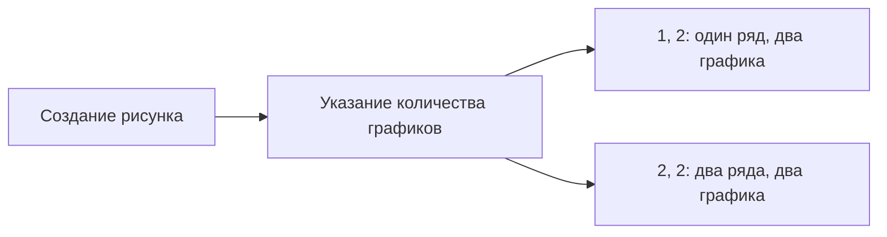

# Создание графиков с несколькими осями координат

## Группировка данных и создание осей

Для анализа данных, например, средней температуры по дням и сезонам, можно использовать группировку данных. Пример группировки: `DailyTemp Bikes Group By`.

После группировки получается объект с двойным индексом, где для каждого дня указана средняя суточная температура и сезон, к которому относится день.

## Создание рисунка с несколькими областями координат

Для создания рисунка с несколькими областями координат используется синтаксис `es`, `fig ax`, `plt.subplots()`.

При создании рисунка можно указать количество графиков. Например, `1, 2` создаст один ряд с двумя графиками, а `2, 2` — два ряда по два графика в каждом.

Графики размещаются в размере, заданном по умолчанию. Если изменить общий размер рисунка, графики также изменятся.

### Индексация осей координат

Если на рисунке несколько осей координат, для доступа к конкретной оси используется индексация. Например, для добавления данных в левую верхнюю ось координат используется индекс `0, 0`.

## Настройка графиков

### Выбор цвета графика

Можно использовать названия цветов или их специальные шестизначные хекс-коды. Хекс-код начинается с хештега и содержит шесть символов.

### Добавление данных на график

Для добавления данных на график нужно выбрать соответствующую ось координат и использовать метод для построения графика.

## Стандартизация шкал координат

Для стандартизации шкал координат можно использовать цикл, который будет перебирать каждую ось координат и применять к ним стандартизацию шкалы.

Например, можно использовать метод `ravel` для преобразования матрицы в одномерный массив и перебрать оси координат в цикле.

Для каждой оси координат можно задать границы для шкалы `y`.

## Подпись шкал

Для подписи шкал можно использовать методы `set_xlabel` и `set_ylabel`.

## Добавление средней годовой температуры

Для добавления средней годовой температуры можно использовать метод `axhline`.

## Улучшение графиков

### Принцип «данные к чернилам»

Согласно принципу «данные к чернилам», нужно убирать все неинформативные элементы с графика.

Неинформативными элементами могут быть верхняя и правая границы осей координат. Для настройки границ можно использовать объект `spines`.

### Добавление легенды и заголовка

Для добавления легенды можно использовать метод `legend`. Для добавления общего заголовка можно использовать метод `suptitle`.

## Сохранение графика

Для сохранения графика можно использовать метод `savefig`. Можно указать расширение файла, например, `pdf` или `png`.

Для сохранения графика в векторном формате можно использовать параметр `dpi`, чтобы увеличить качество графика.

