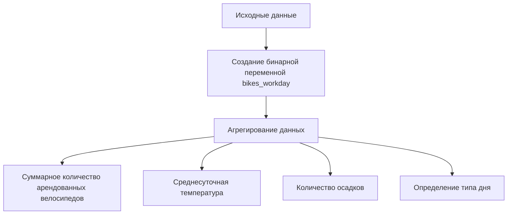
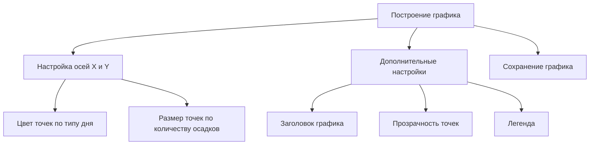

# Построение графика рассеяния с дополнительными переменными

## Подготовка данных

Для построения графика рассеяния, показывающего зависимость между количеством арендованных велосипедов в день и такими факторами, как среднесуточная температура, количество осадков и тип дня (выходной или рабочий), необходимо преобразовать исходные данные.

### Создание бинарной переменной для выходных и праздничных дней

1. Используется функция `np.where` для создания бинарной переменной `bikes_workday`, которая принимает значение 1, если день был выходным (суббота или воскресенье) или праздничным, и 0 в противном случае.

   ```python
   # Пример кода для создания переменной
   bikes_workday = np.where((df['date'].dt.day_name() == 'Saturday') | 
                            (df['date'].dt.day_name() == 'Sunday') | 
                            (df['holiday'] == 1), 1, 0)
   ```

   

2. Объединяются выходные и праздничные дни в одну переменную для упрощения анализа.

### Агрегирование данных

- Находятся суммарное количество арендованных велосипедов в день, среднесуточная температура и количество осадков.
- Для каждого дня выбирается максимум из значений переменной `bikes_workday`, чтобы определить, был ли день выходным или рабочим.



*Диаграмма выше иллюстрирует процесс подготовки данных для построения графика рассеяния.*

## Построение графика рассеяния

Используются библиотеки `matplotlib` и `seaborn` для построения графика рассеяния.

### Настройка графика

- Ось X используется для среднесуточной температуры.
- Ось Y отображает количество арендованных велосипедов.
- Цвет точек зависит от типа дня (выходной или рабочий), задаваемого переменной `bikes_workday`.
- Размер точек определяется количеством осадков.

```python
# Пример кода для построения графика
plt.figure(figsize=(10, 6))
sns.scatterplot(x='temperature', y='bikes_rented', data=df, hue='bikes_workday', size='rainfall_snowfall')
```

### Дополнительные настройки

- Добавляется заголовок графика.
- Устанавливается прозрачность точек для визуализации наложений.
- Создаётся легенда для цветов, чтобы различать выходные и рабочие дни.

```python
# Пример кода для настройки графика
plt.title('Зависимость числа арендованных велосипедов в сутки от температуры, выходного дня и количества осадков')
plt.legend(title='Тип дня')
```

## Сохранение графика

График сохраняется в файл с помощью метода `plt.savefig()`.

```python
# Пример кода для сохранения графика
plt.savefig('bikes_rental_scatterplot.png')
```



*Диаграмма выше показывает последовательность действий при построении и настройке графика рассеяния.*