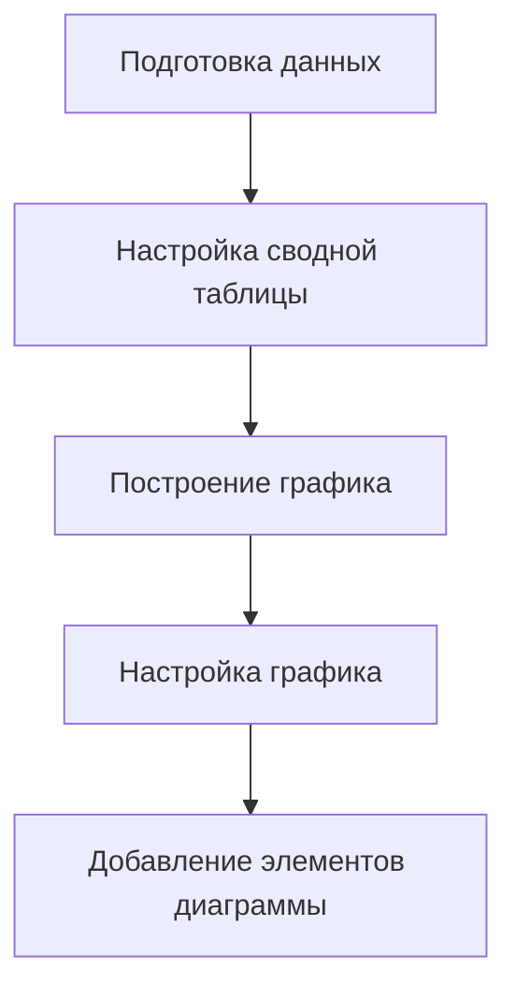

# Основы визуализации в Excel

## Построение линейных графиков

### Создание простого линейного графика

1. **Подготовка данных:**
   - Выделить все столбцы с данными.
   - Перейти в меню «Вставка», выбрать «Сводная таблица».
   - На новом листе создаётся сводная таблица.
   - Даты расположить по строчкам, суммы по арендам перенести в поле значения.
   - Перегруппировать сводную таблицу так, чтобы она группировала значения по неделям.

2. **Настройка сводной таблицы:**
   - Щёлкнуть правой клавишей мыши, выбрать «Группировать», выбрать «Дни».
   - Группировать по семь дней.
   - В поле значения щёлкнуть на аренды, выбрать «Параметры по значению» и взять сумму.

3. **Построение графика:**
   - Скопировать данные отдельно, чтобы построить обычный график, а не сводную диаграмму.
   - Выделить суммы аренд, перейти в пункт меню «Вставка», «Рекомендуемые диаграммы».
   - Выбрать линейную диаграмму.

4. **Настройка графика:**
   - Изменить название графика на «Сумма аренд по неделе».
   - Настроить подписи по горизонтальной оси, чтобы отображались конкретные даты.
   - В меню «Работа с диаграммами» в пункте «Конструктор» можно добавлять или изменять разные элементы.

### Добавление элементов диаграммы

- Добавить название осей.
- Добавить название вертикальной оси (сумма аренд) и горизонтальной оси (недели).

## Построение усложнённого графика

### Пример с температурой

1. **Подготовка данных:**
   - Убрать сумму по арендам из поля значения, добавить поле «Температура».
   - Выбрать «Среднее значение» для температуры.
   - Изменить группировку дней в сводной таблице, чтобы отображалась средняя температура за каждый день весны.

2. **Построение графика:**
   - Выделить нужные значения, скопировать их и добавить справа.
   - Построить график для средней температуры каждого дня весны.
   - Добавить дополнительный столбец со средними значениями температуры за весь год.

3. **Настройка графика:**
   - Рассчитать среднюю температуру за весь год с помощью функции «СРЗНАЧ».
   - Добавить линию, обозначающую среднюю температуру за год.
   - Откорректировать оформление, добавить подписи для оси x и легенду на диаграмме.

Таким образом, мы построили линейный график, на котором есть две линии: линия, которая соответствует нашим данным, и линия, с которой наши данные сравниваются.