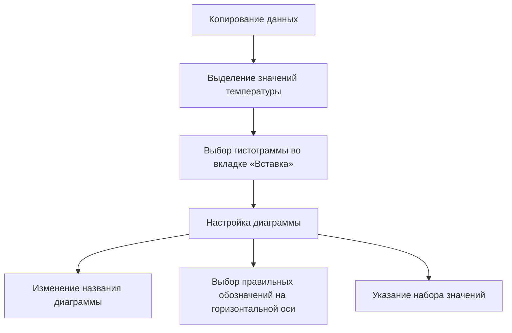
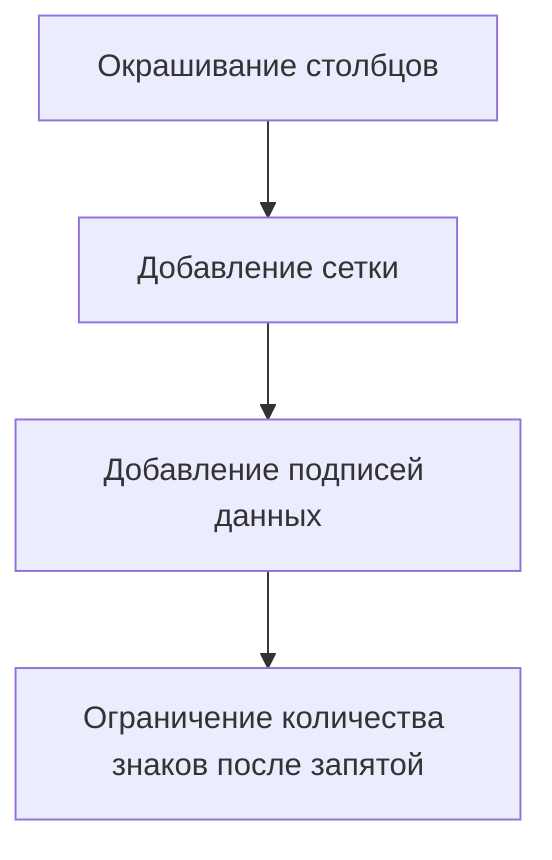

# Построение столбчатой диаграммы и диаграммы рассеяния

## Построение столбчатой диаграммы

### Подготовка данных

Для построения столбчатой диаграммы средней температуры по разным месяцам можно воспользоваться сводной таблицей.

1. Выделяем все столбцы и добавляем сводную таблицу на новый лист.
2. Перетаскиваем колонку «Дата» в строки, а «Температуру» — в значения.
3. Группируем данные по месяцам, используя функцию «Группировать».
4. Для температуры выбираем параметр «Среднее значение».

### Построение диаграммы

1. Копируем полученные данные и размещаем их правее для удобства построения диаграммы.
2. Выделяем значения температуры и выбираем гистограмму во вкладке «Вставка».
3. Настраиваем диаграмму:
   - Изменяем название диаграммы на «Средняя температура по месяцам».
   - На горизонтальной оси выбираем правильные обозначения подписей.
   - Для этого выбираем категории горизонтальной оси, нажимаем правую клавишу и выбираем «Данные».
   - В меню выбираем «Изменить» и указываем набор значений.

### Оформление диаграммы

- Столбцы с положительной температурой можно покрасить в тёплые цвета, а с отрицательной — в холодные.
- В меню «Конструктор» можно добавить сетку, дополнительные горизонтальные или вертикальные линии.
- Для каждый столбца можно добавить подписи данных.
- Чтобы подписи выглядели аккуратно, можно ограничить количество знаков после запятой.

## Итог

Мы рассмотрели основные шаги по построению столбчатой диаграммы, окрашиванию части столбцов в другой цвет и настройке подписей данных для аккуратного и красивого отображения информации.