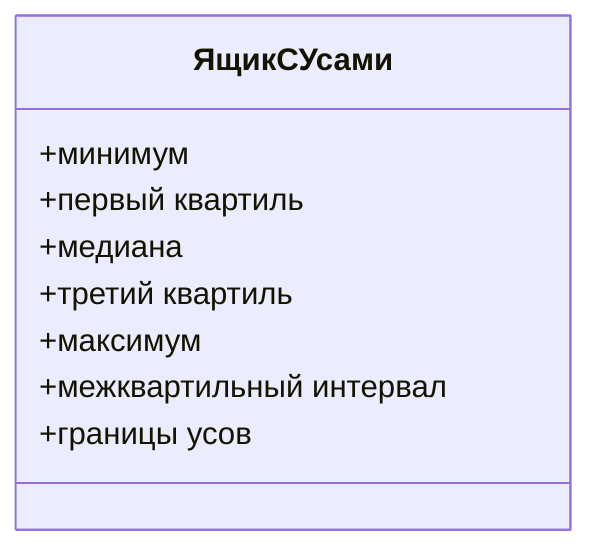
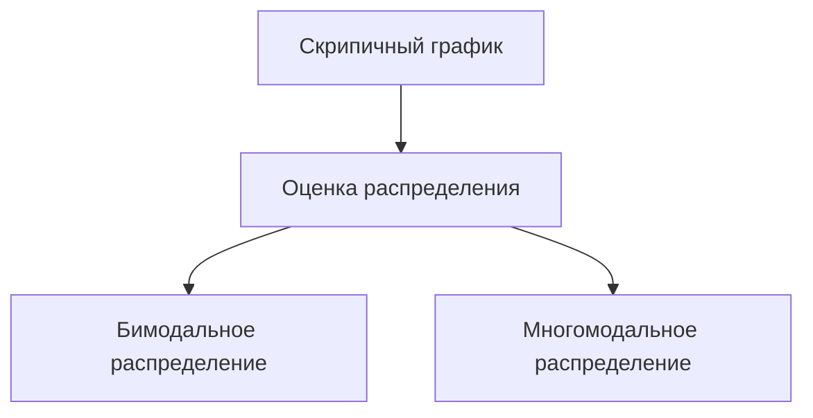

# Графики для анализа данных: ящик с усами и скрипичный график

## Введение

В анализе данных часто используются такие типы графиков, как *ящик с усами* и *скрипичный график*. Эти инструменты позволяют визуализировать статистические характеристики данных и их распределение.

## Инструменты для визуализации данных

Для создания графиков используются следующие библиотеки:

- **NumPy** — библиотека для работы с массивами и математическими функциями.
- **Seaborn** (импортируется под сокращением `sns`) — библиотека для визуализации данных, основанная на **Matplotlib**. Seaborn предоставляет больше возможностей для создания статистических графиков.

### Генерация данных

Для демонстрации работы графиков генерируются случайные данные. В первом случае создаётся нормальное распределение.

## Примеры графиков

### Гистограмма и линия оценки ядерной плотности

Гистограмма показывает частоту встречаемости значений в данных. Линия оценки ядерной плотности — это сглаженная линия, которая позволяет оценить форму распределения.

### Ящик с усами

Ящик с усами представляет собой графическое представление распределения данных через пять числовых статистик: минимум, первый квартиль, медиану, третий квартиль и максимум. Для нормального распределения ящик с усами будет симметричным.

#### Характеристики ящика с усами

- **Межквартильный интервал** — интервал между первым и третьим квартилями.
- **Границы усов** — рассчитываются как 1,5 интраквартильного размаха от первого и третьего квартилей.

### Скрипичный график

Скрипичный график показывает распределение данных в виде «скрипки». Преимущество скрипичного графика перед ящиком с усами в том, что по нему можно оценить распределение данных, даже если оно бимодальное или имеет несколько мод.

## Примеры распределений

### Нормальное распределение

Для нормального распределения ящик с усами будет симметричным, а скрипичный график покажет симметричное распределение данных.

### Логнормальное распределение

Логнормальное распределение характеризуется большим количеством наблюдений и длинным хвостом из-за выбросов. Ящик с усами и скрипичный график позволят увидеть это распределение.

### Бимодальное распределение

Бимодальное распределение имеет две моды. По ящику с усами сложно понять, что распределение бимодальное, но скрипичный график позволит увидеть две моды.