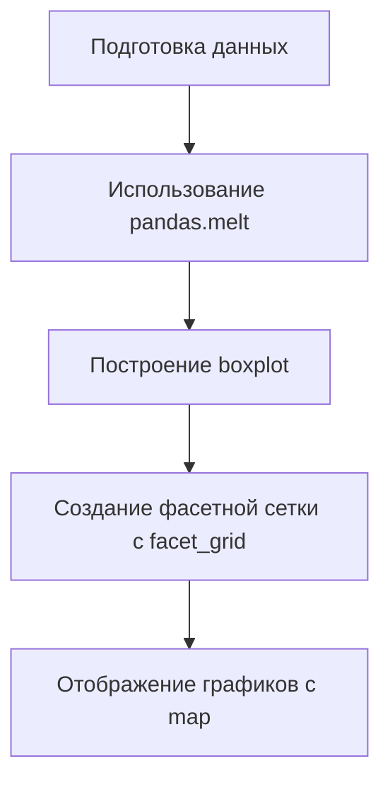

# Построение нескольких графиков одновременно

## Подготовка данных

Для того чтобы построить графики распределения одной количественной переменной по всем категориям категориальных переменных, можно использовать функцию `pandas.melt()`.

### Использование функции `pandas.melt()`

Функция `pandas.melt()` позволяет преобразовать датафрейм в нужный вид. В качестве первого аргумента передаётся оригинальный датафрейм. Затем используются параметры `id_vars` и `value_vars`.

- `id_vars` — количество переменной, которую мы хотим рассмотреть. Например, возраст.
- `value_vars` — категориальные переменные, по которым мы хотим смотреть распределение нашего возраста.

Пример использования функции `pandas.melt()`:

```python
pandas.melt(
    id_vars="возраст",
    value_vars=cat_features
)
```


## Построение графиков

После преобразования датафрейма можно построить графики для всех категориальных переменных. Для этого используется функция `boxplot()`.

### Функция `boxplot()`

Функция `boxplot()` строит ящики с усами для переменных X и Y. Она принимает три аргумента: X, Y и `quarps`.

При вызове функции `boxplot()` строится ящик с усами для переменных X и Y. Здесь ожидается категориальная переменная и количество.

Пример использования функции `boxplot()`:

```python
boxplot(
    x="категориальная переменная",
    y="количество",
    quarps={}
)
```

### Создание фасетной сетки

Для создания фасетной сетки используется функция `facet_grid()` из библиотеки `sns`. Она создаёт много осей координат.

Пример использования функции `facet_grid()`:

```python
sns.facet_grid(
    data=df_melting,
    row="переменная",
    col="переменная",
    sharex=False,
    sharey=False,
    height=5
)
```

### Отображение графиков

После создания фасетной сетки можно отобразить графики с помощью функции `map()`. Она отображает функцию `boxplot()` на каждую ячейку координатной сетки.

Пример использования функции `map()`:

```python
map(boxplot)
```

### Процесс построения графиков



Диаграмма выше иллюстрирует последовательность шагов для построения нескольких графиков одновременно.