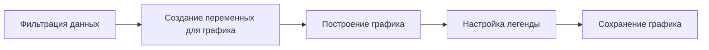
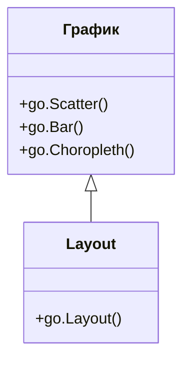
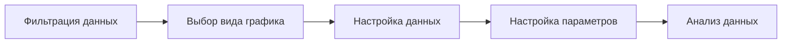

# Визуализация данных с использованием Plotly

## Добавление второй страны на график

Для добавления второй страны на график продолжительности жизни необходимо выполнить следующие шаги:

1. **Фильтрация данных:**
   - Отфильтровать данные из основного датасета.
   - Пример: фильтрация по стране Афганистан.

2. **Создание переменных для графика:**
   - Создать переменную `trace` для каждой страны.
   - Пример: `trace0` для Германии и `trace1` для Афганистана.

3. **Построение графика:**
   - Использовать функцию `go.Scatter` для построения графика.
   - Передать переменные `trace0` и `trace1` в список.

4. **Настройка легенды:**
   - Названия графиков задаются внутри функции, которая строит график.
   - Пример: `name='Germany'` и `name='Afghanistan'`.

5. **Сохранение графика:**
   - График можно сохранить в виде картинки или изучать в текущем виде.

*Диаграмма выше иллюстрирует последовательность шагов для добавления второй страны на график.*

## Настройка графика и layout в Plotly

В Plotly настройка графика и layout осуществляется следующим образом:

- **График:**
  - Настройка конкретных данных, информации, цвета и других параметров.
  - Функции: `go.Scatter`, `go.Bar`, `go.Choropleth`.

- **Layout:**
  - Настройка общих параметров, таких как шкалы, заголовки и другие.
  - Функция: `go.Layout`.

*Диаграмма показывает взаимосвязь между настройкой графика и layout в Plotly.*

## Построение географической карты с помощью Choropleth

Choropleth — это тепловая географическая карта, которую можно построить в Plotly. Для построения карты необходимо выполнить следующие шаги:

1. **Фильтрация данных:**
   - Отфильтровать данные по году.
   - Пример: год равен 1982.

2. **Выбор вида графика:**
   - Использовать Choropleth в качестве вида графика.

3. **Настройка данных:**
   - Переменная `Z` используется для передачи данных на карту.
   - Пример: использование продолжительности жизни.

4. **Настройка параметров:**
   - Настройка параметра `Location Mode` для определения границ стран.
   - Пример: `Location Mode='country names'`.

5. **Анализ данных:**
   - Анализ средней продолжительности жизни для каждой страны.

*Диаграмма выше показывает последовательность шагов для построения географической карты с помощью Choropleth.*