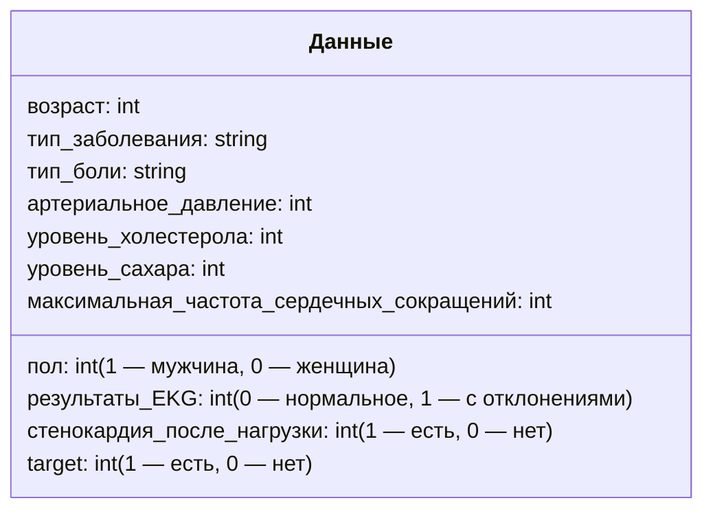
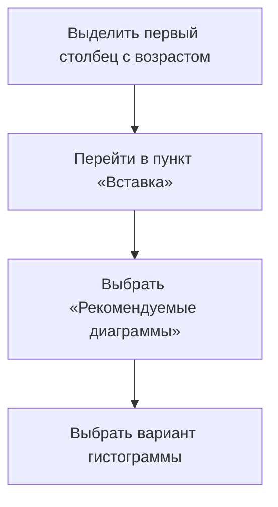
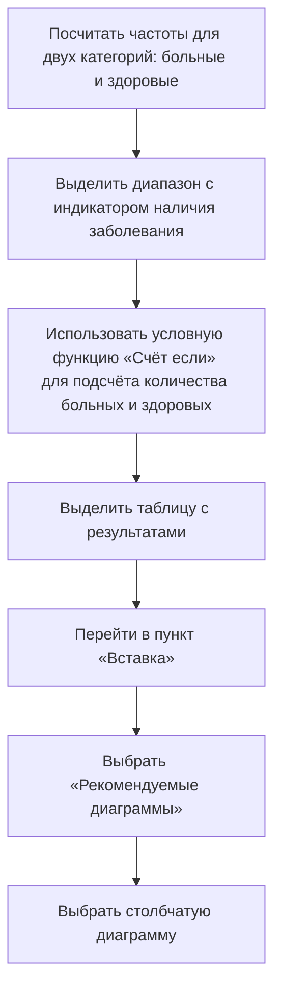

# Разведочный анализ данных и визуализация

## Введение в разведочный анализ данных

**Разведочный анализ данных** — это метод анализа данных, который позволяет составить общие представления о наборе данных с помощью описательной статистики и визуализации. Этот анализ даёт первое представление о данных, позволяя сделать выводы и понять основные характеристики.

## Набор данных для анализа

В качестве примера используется набор данных о людях с подозрением на сердечно-сосудистые заболевания. В наборе присутствуют следующие признаки:

- возраст пациента;
- пол пациента (1 — мужчина, 0 — женщина);
- тип заболевания;
- тип боли (стенокардия или другой тип боли);
- артериальное давление в состоянии покоя;
- уровень холестерола;
- уровень сахара в крови натощак;
- результаты EKG в состоянии покоя (0 — нормальное, 1 — с отклонениями);
- максимально зафиксированная частота сердечных сокращений;
- стенокардия в результате физической нагрузки (1 — есть, 0 — нет);
- target — наличие сердечно-сосудистого заболевания (1 — есть, 0 — нет).

*Диаграмма выше иллюстрирует структуру набора данных с описанием каждого признака.*

## Инструменты разведочного анализа данных

### Гистограмма

Гистограмма используется для визуализации распределения значений количественных переменных. Например, можно построить гистограмму для возраста пациентов:

*На схеме показан процесс построения гистограммы для анализа распределения возраста пациентов.*

### Столбчатая диаграмма

Столбчатая диаграмма используется для сравнения количества значений для разных порядковых или номинальных признаков. Например, можно построить столбчатую диаграмму для сравнения количества больных и здоровых пациентов:

*Схема демонстрирует шаги для создания столбчатой диаграммы, которая сравнивает количество больных и здоровых пациентов.*

## Заключение

В этом видео мы рассмотрели, как можно применить гистограмму и столбчатую диаграмму для первичного анализа и выводов по данным. В следующем видео мы познакомимся с новым типом диаграммы.