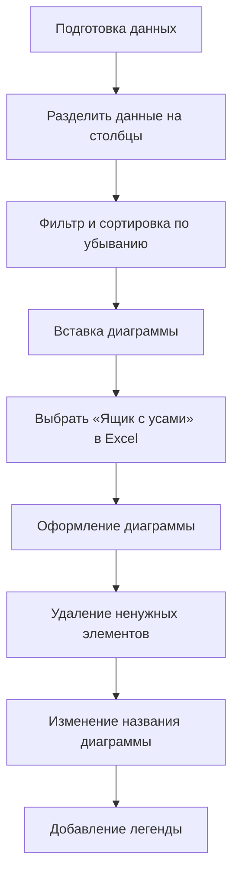
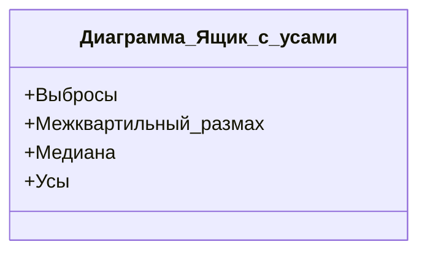

# Разведочный анализ данных: диаграмма «ящик с усами» (боксплот)

## Введение

В данном разделе рассматривается метод разведочного анализа данных с использованием диаграммы «ящик с усами». Этот метод позволяет визуализировать центральные тенденции и разброс данных, а также сравнивать распределение двух величин.

## Построение диаграммы «ящик с усами»

Для построения диаграммы «ящик с усами» необходимо выполнить следующие шаги:

**Пояснение:** Процесс построения диаграммы «ящик с усами» включает подготовку данных, вставку диаграммы и её оформление.

## Анализ диаграммы «ящик с усами»

Диаграмма «ящик с усами» предоставляет следующую информацию:

**Пояснение:** Основные элементы диаграммы «ящик с усами» включают выбросы, межквартильный размах, медиану и усы.

На диаграмме «ящик с усами» можно увидеть, что:

- У больных пациентов больше разброс возраста.
- Медиана возраста ниже у больных, чем у здоровых.
- Средний возраст у больных также меньше, чем у здоровых.

## Дополнительные возможности

Можно добавить подписи к диаграмме, чтобы указать значения медианы, минимума, максимума и других мер. Однако обычно это не делается, так как выглядит нагромождённо.

## Заключение

Диаграмма «ящик с усами» является мощным инструментом для анализа данных. Она позволяет визуализировать центральные тенденции и разброс данных, а также сравнивать распределение двух величин.