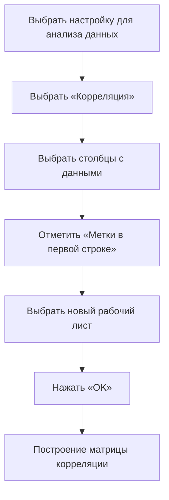
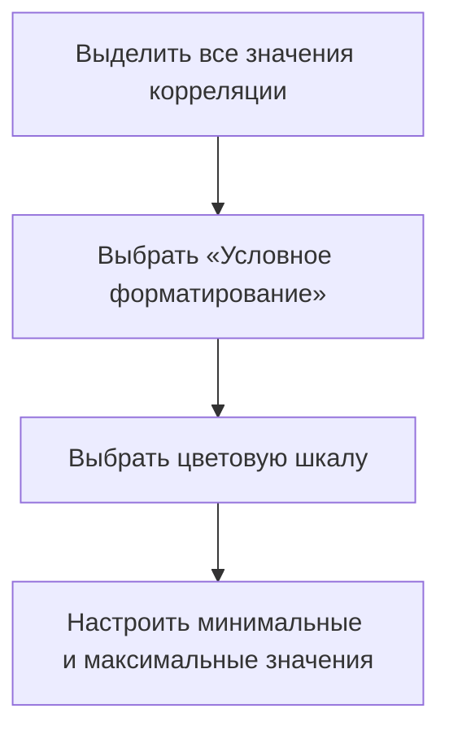

# Разведочный анализ данных: построение тепловой карты в Excel

## Определение и область применения

**Разведочный анализ данных** включает в себя использование различных диаграмм для визуализации данных. Одним из типов визуализации является **тепловая карта**, которая позволяет наглядно представить матрицу корреляции.

## Построение тепловой карты в Excel

### Подготовка данных

Для построения тепловой карты в Excel необходимо выполнить следующие шаги:

1. Выбрать количественные переменные для анализа. В данном случае используются:
   - возраст пациента;
   - артериальное давление в состоянии покоя;
   - уровень холестерола;
   - максимально зафиксированная частота сердцебиения.

2. Скопировать выбранные переменные в отдельную таблицу.

### Построение матрицы корреляции

Пояснение: На схеме показан процесс построения матрицы корреляции в Excel.

### Преобразование матрицы корреляции в тепловую карту

1. Заполнить все ячейки матрицы корреляции, используя симметрию матрицы.
2. Отредактировать границы таблицы, чтобы они были одинаковыми.
3. Увеличить высоту строчек, чтобы таблица стала более квадратной.

### Условное форматирование

Для раскраски ячеек матрицы корреляции в зависимости от коэффициента корреляции используется **условное форматирование**:

Пояснение: На схеме показан процесс применения условного форматирования для создания тепловой карты.

## Варианты раскраски

Существуют различные варианты раскраски тепловой карты:
- от белого к красному;
- от синего к красному;
- трёхцветная шкала (минимальное значение — голубой, максимальное — красный, по центру — белый).

## Преимущества тепловой карты

Тепловая карта позволяет:
- быстро находить самые большие и самые маленькие коэффициенты корреляции;
- определять самые сильные и самые слабые взаимосвязи;
- визуально оценивать взаимосвязь между переменными.

## Заключение

В данном видео было показано, как представить матрицу корреляции в более наглядном виде с помощью тепловой карты. Это позволяет быстрее делать выводы и находить определённые значения, не рассматривая каждое число отдельно.