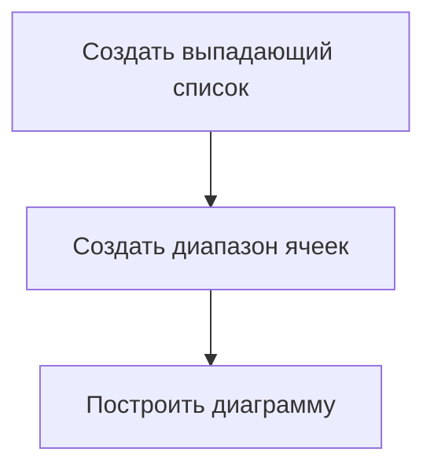

# Создание интерактивных диаграмм

## Предварительные вычисления

Для построения интерактивной диаграммы необходимо выполнить предварительные вычисления. В частности, нужно посчитать суммарное количество аренд для каждого сезона, отдельно для праздничных и непраздничных дней.

Для этого используется функция **СУММЕСЛИМН** для поиска суммы по нескольким условиям. В данном случае условия — это праздник или непраздник и сезон.

### Пример использования функции СУММЕСЛИМН

1. Первый аргумент — диапазон суммирования (количество аренд).
2. Диапазон первого условия (сезон).
3. Само первое условие (например, «зима»).
4. Диапазон второго условия (праздник или непраздник).
5. Само второе условие (например, «holiday» для праздничных дней).

После выполнения вычислений получается таблица с суммарным количеством аренд для каждого сезона и типа дня.

## Создание интерактивной диаграммы

Для создания интерактивной диаграммы необходимо выполнить следующие шаги:

1. Создать выпадающий список для выбора типа дня (праздник или непраздник).
2. Создать диапазон ячеек, который будет меняться в зависимости от выбранного типа дня.
3. Построить диаграмму на основе созданного диапазона ячеек.

### Создание выпадающего списка

Для создания выпадающего списка используется кнопка **«Проверка данных»** во вкладке **«Данные»**. В списке можно выбрать тип дня (праздник или непраздник).

### Создание диапазона ячеек

Для создания диапазона ячеек используется функция **СМЕЩ**. Эта функция позволяет выбрать нужную строчку в зависимости от выбранного типа дня.

### Построение диаграммы

Для построения диаграммы используются первые две строчки таблицы с суммарным количеством аренд. Диаграмма строится с помощью гистограммы с группировкой.

## Настройка переключателя

Для настройки переключателя необходимо выделить столбцы диаграммы и выбрать пункт **«Выбрать данные»**. В окне выбора данных нужно изменить значение диапазона ячеек, чтобы он зависел от выбранного типа дня.

### Пример настройки переключателя

1. Выделить столбцы диаграммы.
2. Нажать правую клавишу мыши и выбрать пункт **«Выбрать данные»**.
3. В окне выбора данных выбрать элемент легенды (например, «праздник») и нажать **«Изменить»**.
4. В окне изменения ряда изменить значение диапазона ячеек, добавив название функции, которая позволяет менять диапазон (например, «holiday»).

После настройки переключателя диаграмма будет меняться в режиме реального времени в зависимости от выбранного типа дня.

## Заключение

В данном видео было показано, как сделать из обычной статичной диаграммы интерактивную диаграмму, которую можно менять в режиме реального времени с помощью специальных переключателей.