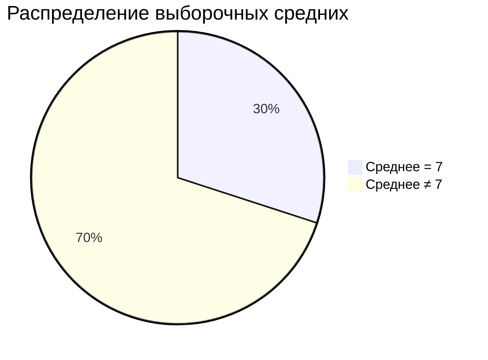
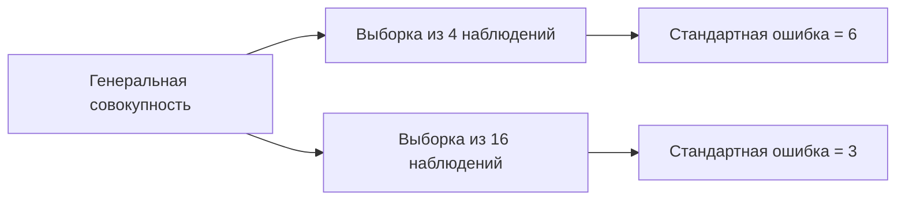

# Распределение выборочных средних и стандартная ошибка

## Математическое ожидание выборочного среднего

Рассмотрим пример с генеральной совокупностью, где переменная $x$ имеет среднее значение $7,2$. Из этой совокупности извлекаются все возможные выборки размером $3$ без возвращения.

Для каждой выборки вычисляется среднее арифметическое. Например, для первой выборки $(12, 6, 9)$ среднее арифметическое равно:

$$
\frac{12 + 6 + 9}{3} = 9
$$

После вычисления средних арифметических для всех выборок можно заметить, что ни одно из средних не совпадает точно со средним арифметическим генеральной совокупности. Однако среднее всех выборочных средних равно среднему генеральной совокупности:

$$
\frac{72}{10} = 7,2
$$

Эта мера называется *математическим ожиданием выборочного среднего*. Мы надеемся, что при извлечении выборки из генеральной совокупности, среднее выборки будет максимально приближено к этой величине.

### Распределение выборочных средних

Если построить распределение выборочных средних, то можно заметить, что мода этого распределения равна $7$, что максимально близко к среднему арифметическому генеральной совокупности. Вероятность получить выборку со средним $7$ составляет $30\%$.



Если поставить ограничение на отклонение среднего выборки от среднего генеральной совокупности, то вероятность получить выборку с минимальным отклонением составит $70\%$.

## Стандартная ошибка выборочного среднего

Стандартная ошибка выборочного среднего обозначается как $\sigma_{\bar{x}}$ и рассчитывается следующим образом:

$$
\sigma_{\bar{x}} = \frac{\sigma}{\sqrt{n}}
$$

где $\sigma$ — стандартное отклонение генеральной совокупности, а $n$ — количество наблюдений в выборке.

Эта ошибка возникает, когда у нас маленькая выборка или когда в нашей генеральной совокупности большая вариативность, большая дисперсия. Чем дисперсия меньше или чем выборка наша больше, тем ошибка будет меньше.

### Пример расчёта стандартной ошибки

Предположим, у нас есть генеральная совокупность со средним $5$ и стандартным отклонением $12$. Рассмотрим два случая:

1. Выборка из $4$ наблюдений:

$$
\sigma_{\bar{x}} = \frac{12}{\sqrt{4}} = 6
$$

2. Выборка из $16$ наблюдений:

$$
\sigma_{\bar{x}} = \frac{12}{\sqrt{16}} = 3
```



Мы видим, что стандартная ошибка действительно уменьшается с увеличением размера выборки.