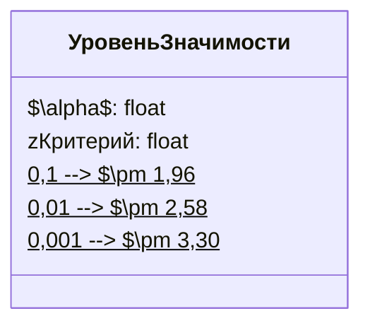

# Проверка гипотезы о наборе веса котиков

## Постановка задачи

Рассмотрим гипотезу о том, что если оставить котика на неделю у бабушки, он прибавит в весе. Для проверки гипотезы проведём исследование.

### Генеральная совокупность и выборка

Предположим, что у нас есть генеральная совокупность всех котиков, которые не живут у бабушки. В среднем эти котики не набирают вес и не худеют, то есть их средний набор веса составляет 0 грамм в неделю. Среди квадратического отклонения этой генеральной совокупности — 20, и она распределена нормально.

Далее мы берём из неё выборку из 4 котиков и оставляем их на неделю у бабушки. После этого мы хотим сделать вывод о генеральной совокупности котиков, которые неделю прожили у бабушки, и найти её среднее значение.

## Формулировка гипотез

### Нулевая гипотеза

Нулевая гипотеза заключается в том, что котики у бабушек тоже не набирают вес. То есть набор веса котиков, которые прожили неделю у бабушек, будет таким же, как и у генеральной совокупности, которая не прожила неделю у бабушек.

### Альтернативная гипотеза

Альтернативная гипотеза заключается в том, что средний набор веса котиков, проживших неделю у бабушки, не будет равен нулю.

## Выбор критерия статистической значимости

Для проверки гипотезы выберем уровень статистической значимости $\alpha = 0,05$. Это означает, что мы будем ориентироваться на 95% нашей выборки.

## Расчёт среднего изменения веса

Предположим, что у нас есть нормальные затраты на определение выборочных средних. В центре колокольчиков располагаются большинство средних выборок, которые мы можем получить из генеральной совокупности. Чем дальше в хвосты, тем меньше количество выборок, но они будут обладать аномальными средними значениями.

Мы хотим выбрать такую область значений, в которую попадает 95% средних в нашем случае. Для этого нам нужно знать, какие значения z-критерия отделяют разные пропорции выборки. Например, 95% выборки для статистического уровня значимости 5% располагаются между $-1,96$ и $+1,96$.

Если мы сейчас рассчитаем среднее изменение веса для наших котиков из выборки и z-критерий этого среднего попадёт в один из хвостов, это будет означать, что либо эти котики действительно прибавили вес или, может быть, наоборот, похудели после недели у бабушки, либо мы просто случайно взяли такую выборку котиков, которые в принципе меняют вес, и она попала в один из этих хвостов.

Уровень значимости $\alpha$ — это процент вероятности того, что мы сделали ошибку, просто взяв неудачную выборку.

## Популярные уровни коэффициента $\alpha$ и соответствующие им значения z-критерия

*Диаграмма показывает связь между уровнем значимости и соответствующими значениями z-критерия.*

## Расчёт среднего изменения веса для котиков

Возьмём выборку из 4 котиков и узнаем, какое было изменение веса после того, как они прожили неделю у бабушки:

* Первый котик набрал 150 грамм.
* Второй котик похудел на 120 грамм.
* Третий котик набрал 70 грамм.
* Четвёртый котик набрал 60 грамм.

Найдём среднее изменение веса:

$\frac{150 + (-120) + 70 + 60}{4} = 40$ грамм.

То есть в среднем котики, которые неделю прожили у бабушки, прибавили в весе на 40 грамм.

## Проверка гипотезы

Рассчитаем z-критерий для среднего изменения веса:

$z = \frac{40 - 0}{10} = 4$.

Теперь нужно проверить, попадает ли это значение в область критических значений. Если z-критерий больше $1,96$ или меньше $-1,96$, то мы можем отвергнуть нулевую гипотезу. В нашем случае z-критерий равен 4, что больше $1,96$. Следовательно, мы можем отвергнуть нулевую гипотезу и сделать вывод, что котики, прожившие неделю у бабушки, в среднем набирают вес. Однако есть 5% вероятность, что мы просто взяли неудачную выборку с котиками, которые мало двигаются.

