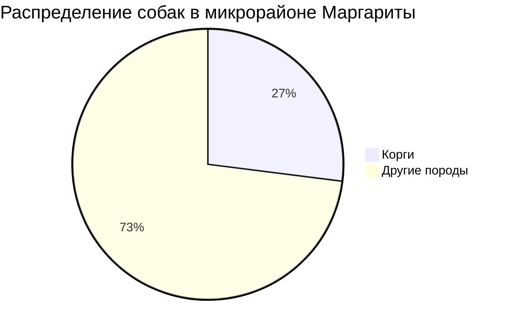
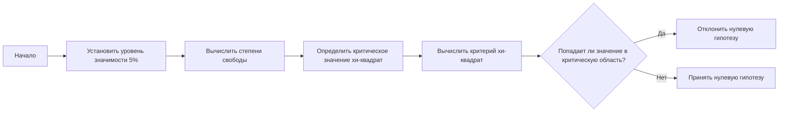
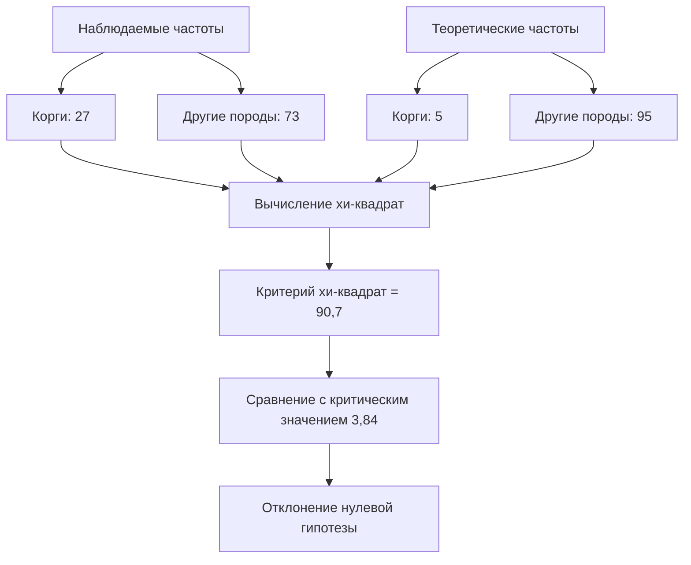

# Критерий хи-квадрат Пирсона

## Проверка гипотезы о соответствии частот

### Пример с собаками породы корги

Рассмотрим пример, в котором проверяется гипотеза о том, что частоты в некотором распределении соответствуют известным заранее теоретическим частотам.

Предположим, что Маргарита считает, что в её микрорайоне очень много собак породы корги. Она думает, что это «корги-столица Москвы», так как в других районах она встречает собак этой породы гораздо реже.

Маргарита провела опрос и обнаружила, что в её микрорайоне живёт 100 собаководов, из которых 27 — гордые хозяева собак породы корги, а 73 — владельцы собак других пород. Это **наблюдаемые частоты**.

Также предположим, что Маргарита обладает тайным знанием о распределении собак в целом по Москве. Она знает, что только 5% всех собак — это собаки породы корги, а 95% — собаки других пород. Переведём это процентное соотношение в ожидаемые частоты. Если бы микрорайон Маргариты соответствовал этому распределению, то мы бы ожидали встретить там 5 собаководов, которые завели корги, и 95 собаководов, которые завели собаку другой породы.

Теперь проверим гипотезу: действительно ли микрорайон Маргариты является «корги-столицей Москвы»? Действительно ли там корги больше, чем должно быть по нашему теоретическому распределению?

### Уровень статистической значимости и степени свободы

Перед тем как тестировать гипотезу, нужно определиться с уровнем статистической значимости. Выберем его равным 5%.

Степени свободы для теста хи-квадрат считаются как количество категорий минус 1. В нашем случае они будут равны 1. При таком количестве степеней свободы значение критерия хи-квадрат 3,84 отделяет 95% выборки от 5% выборки.

Если мы протестируем нашу гипотезу о том, что микрорайон Маргариты в своём распределении не отличается от среднего распределения по Москве, мы будем высчитывать критерий хи-квадрат и смотреть, попал ли он в критическую область значений от 3,84 до плюс бесконечности.

### Формула для вычисления критерия хи-квадрат

Чтобы рассчитать хи-квадрат в Пирсоне, для каждой категории нужно найти разность между наблюдаемой частотой и ожидаемой теоретической, возвести эту разность в квадрат и разделить на теоретические частоты. Делаем это для каждой категории и результаты суммируем.

### Расчёт критерия для примера с корги

1. Наблюдаемая частота — 27, ожидаемая — 5. Возводим разность в квадрат и делим на 5.
2. Наблюдаемая частота — 73, ожидаемая — 95. Возводим разность в квадрат, делим на 95.

Если всё это рассчитать, мы узнаем, что наш критерий хи-квадрат равен 90,7. Сравним это значение с нашим критическим значением. Очевидно, что 90,7 больше 3,84. Значит, это значение попадает в критическую область.

Мы можем отвергнуть нулевую гипотезу о том, что наблюдаемые частоты не отличаются от распределения теоретических частот. Делаем вывод, что в районе Маргариты корги встречаются чаще, чем они должны были бы, если бы её район соответствовал распределению среднему по Москве. Однако мы не можем утверждать, что район Маргариты является «корги-столицей Москвы».

