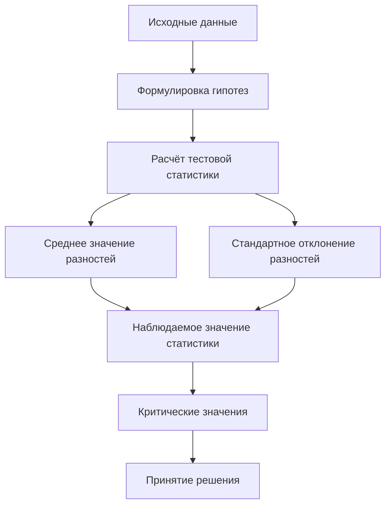

# Применение парного критерия Стьюдента для проверки гипотез

## Постановка задачи

В данном разделе рассматривается задача проверки гипотезы о влиянии специализированных курсов по английскому языку на знания студентов. Для этого используются данные о результатах экзаменов до и после прохождения курсов.

### Исходные данные

- **Оценки до курсов:** 92, 98, 64, 70, 72, 81, 89, 85.
- **Оценки после курсов:** 96, 100, 70, 73, 79, 90, 93.

## Формулировка гипотез

- **Нулевая гипотеза ($H_0$):** средняя разность между оценками равна нулю.
- **Альтернативная гипотеза ($H_1$):** средняя разность между оценками не равна нулю.

## Расчёт тестовой статистики

Для парного теста статистика рассчитывается следующим образом:

$$
t = \frac{\bar{d}}{s_d / \sqrt{n}}
$$

где:
- $\bar{d}$ — среднее значение разностей,
- $s_d$ — стандартное отклонение разностей,
- $n$ — объём выборки.

### Расчёт среднего значения разностей

1. Найдём разности между оценками до и после курсов:
   - 4, 2, 6, 3, 7, 9, 1, 8.
2. Среднее значение разностей:
   $$
   \bar{d} = \frac{4 + 2 + 6 + 3 + 7 + 9 + 1 + 8}{8} = 5
   $$

### Расчёт стандартного отклонения разностей

1. Вычислим разности между каждой разницей и средней разностью:
   - $4 - 5 = -1$,
   - $2 - 5 = -3$,
   - $6 - 5 = 1$,
   - $3 - 5 = -2$,
   - $7 - 5 = 2$,
   - $9 - 5 = 4$,
   - $1 - 5 = -4$,
   - $8 - 5 = 3$.
2. Возведём в квадрат каждую разность:
   - $(-1)^2 = 1$,
   - $(-3)^2 = 9$,
   - $1^2 = 1$,
   - $(-2)^2 = 4$,
   - $2^2 = 4$,
   - $4^2 = 16$,
   - $(-4)^2 = 16$,
   - $3^2 = 9$.
3. Сумма квадратов разностей: $1 + 9 + 1 + 4 + 4 + 16 + 16 + 9 = 60$.
4. Стандартное отклонение:
   $$
   s_d = \sqrt{\frac{60}{7}} \approx 2,928
   $$

### Наблюдаемое значение статистики

$$
t = \frac{5}{2,928 / \sqrt{8}} \approx 4,83
$$

## Критические значения

Для уровня значимости 5% и 7 степеней свободы критические значения равны $\pm 2,365$.

## Принятие решения

Наблюдаемое значение $t = 4,83$ попадает в критическую область, поэтому нулевая гипотеза отвергается в пользу альтернативной. Это означает, что средняя разность между оценками не равна нулю, и курсы оказали значимое влияние на знания студентов.

**Пояснение к диаграмме:** На схеме представлен процесс проверки гипотезы с использованием парного критерия Стьюдента. Каждый шаг логически связан с предыдущим, что позволяет наглядно увидеть последовательность действий.

