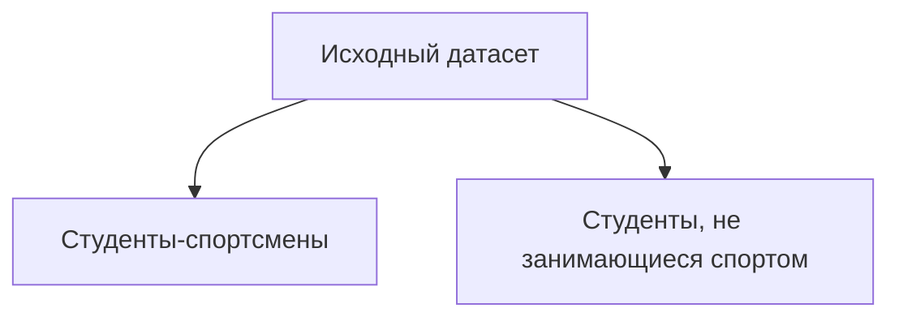
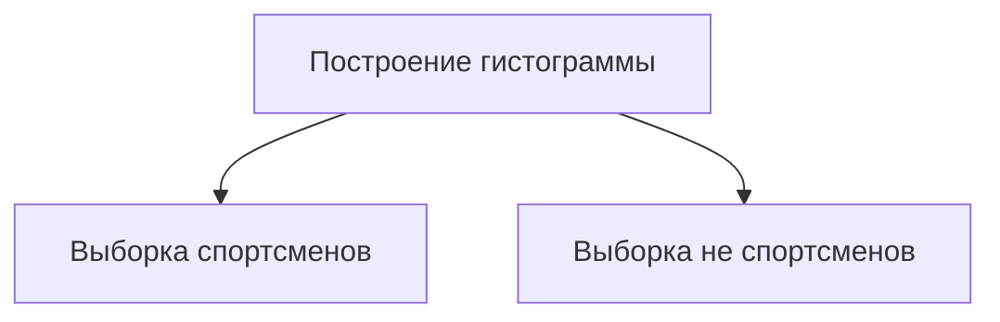
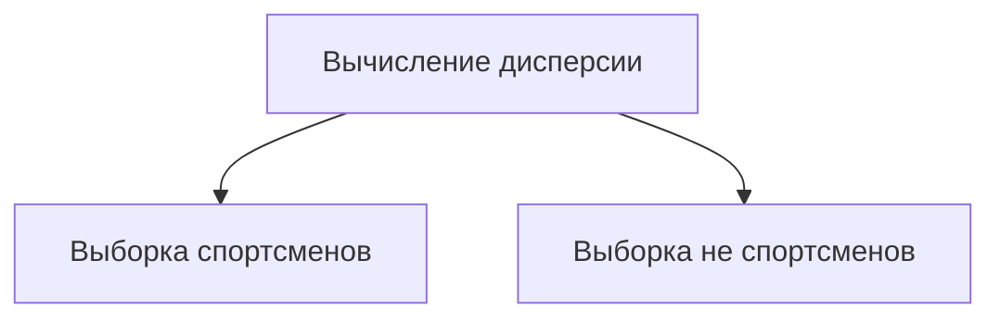

# Проверка статистических гипотез с помощью t-теста

## Импорт библиотек и загрузка данных

Для проверки статистических гипотез с помощью t-теста необходимо импортировать следующие библиотеки:

- `pandas`;
- `numpy`;
- `scipy.stats`.

Далее необходимо загрузить датафрейм с данными. В данном случае используются результаты некоторых студентов британского вуза, включая информацию о том, является ли студент спортсменом, и время, за которое студент пробегает милю.

## Формулировка гипотезы

Будем тестировать гипотезу о разнице между количеством секунд, за которые милю пробегают спортсмены и не спортсмены. Нулевая гипотеза будет заключаться в отсутствии разницы между этими средними.

## Подготовка данных

Перед расчётом статистики и определением критических значений необходимо убедиться, что данные соответствуют предпосылкам:

1. Переменные распределены нормально.
2. Соблюдается условие равенства дисперсий.

### Перевод переменной из минут в секунды

Для начала необходимо перевести переменную «Mine-Minute Duration» из минут в секунды. Для этого применяется функция, которая разбивает строку по двоеточию, извлекает количество минут и секунд, переводит минуты в секунды и сохраняет результат в новую переменную «Майл сек дюр».

### Разбиение датасета на две выборки

Далее датасет разбивается на две выборки:

- студенты, занимающиеся спортом;
- студенты, не занимающиеся спортом.

## Проверка предпосылок

### Проверка нормальности распределения

Для проверки нормальности распределения строится гистограмма для каждой выборки. Если форма гистограммы стремится к нормальной, то предпосылку нормальности можно считать выполненной.

### Проверка равенства дисперсий

Для проверки равенства дисперсий вычисляется дисперсия для каждой выборки. Если дисперсии сильно различаются, то необходимо использовать t-тест с поправкой Вэлча.

## Расчёт t-критерия

### Расчёт степеней свободы с поправкой Вэлча

С поправкой Вэлча степени свободы рассчитываются более консервативно. Формула для расчёта степеней свободы выглядит следующим образом:

$$df = \frac{(V_1 + V_2)^2}{\frac{V_1^2}{N_1 - 1} + \frac{V_2^2}{N_2 - 1}}$$

где $V_1$ и $V_2$ — дисперсии для первой и второй групп соответственно, $N_1$ и $N_2$ — количество наблюдений в первой и второй группах соответственно.

### Расчёт стандартной ошибки

Стандартная ошибка рассчитывается следующим образом:

$$SE = \sqrt{V_1 + V_2}$$

### Расчёт t-критерия

t-критерий рассчитывается следующим образом:

$$t = \frac{M_1 - M_2}{SE}$$

где $M_1$ и $M_2$ — средние для первой и второй выборок соответственно.

## Проверка гипотезы

Если значение t-критерия больше критического значения, то нулевую гипотезу можно отвергнуть и сделать вывод о статистической значимости разницы между средними.

В данном случае было получено сообщение, что нулевую гипотезу можно отвергнуть и разница между средними статистически значима.

