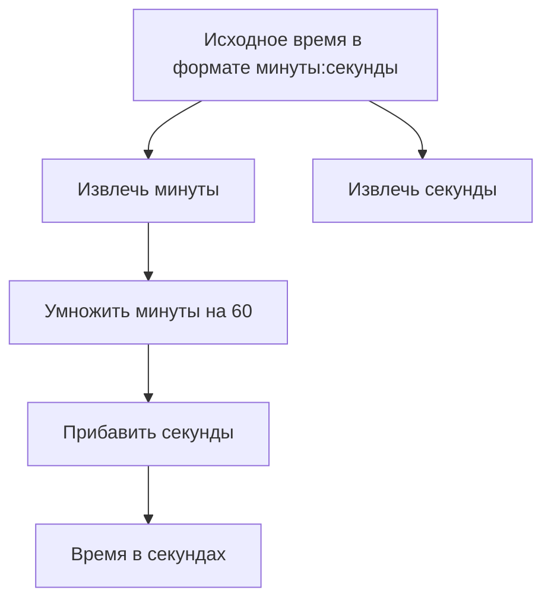
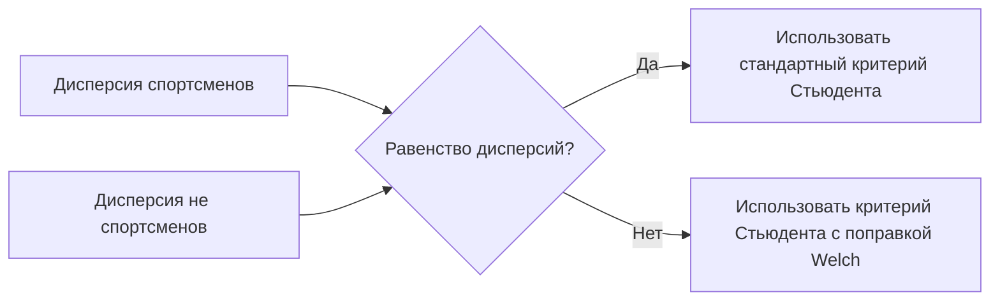

# Проверка гипотез с помощью двухвыборочного критерия Стьюдента

## Подготовка данных

Для начала необходимо преобразовать данные из формата CSV в табличный вид. Для этого:

1. Выделите столбец.
2. Перейдите во вкладку «Данные» и выберите пункт «Текст по столбцам».
3. Выберите разделитель — запятую.
4. Нажмите «Готово».

В результате получим таблицу с данными о студентах, участвовавших в соревновании по бегу на милю. В таблице есть информация о том, занимались ли студенты профессионально спортом (столбец «Атлет»: 1 — да, 0 — нет) и время, за которое каждый студент пробежал милю.

## Формулировка гипотезы

*Нулевая гипотеза* заключается в том, что разница между средним временем студентов, занимавшихся спортом, и средним временем студентов, не занимавшихся спортом, равна нулю.

## Преобразование времени

Для удобства анализа необходимо преобразовать время из формата «минуты:секунды» в секунды. Для этого:

1. Используйте функцию «Минуты» для извлечения количества минут из исходного формата времени.
2. Используйте функцию «Секунды» для извлечения количества секунд.
3. Умножьте количество минут на 60 и прибавьте количество секунд, чтобы получить общее время в секундах.

*Схема выше иллюстрирует процесс преобразования времени из формата «минуты:секунды» в секунды.*

## Проверка предпосылок для применения критерия Стьюдента

### Нормальность распределения

Данные должны быть распределены нормально. Проверим это с помощью гистограммы:

1. Добавьте фильтр, чтобы отдельно построить гистограмму для спортсменов и не спортсменов.
2. Постройте гистограмму для не спортсменов.
3. Постройте гистограмму для спортсменов.

Если распределение близко к нормальному, можно считать, что данные удовлетворяют этому условию.

### Равенство дисперсий

Вторая предпосылка — равенство дисперсий для спортсменов и не спортсменов. Если дисперсии сильно отличаются, можно использовать критерий Стьюдента с поправкой Welch, который учитывает различия в дисперсиях.

*Схема выше показывает процесс проверки равенства дисперсий и выбора подходящего критерия Стьюдента.*

## Вывод

В данном видео мы проверили предпосылки для применения двухвыборочного критерия Стьюдента для проверки гипотезы о разнице в среднем времени пробега мили между спортсменами и не спортсменами. В следующем видео мы рассмотрим, как проверить гипотезу с помощью этого критерия.