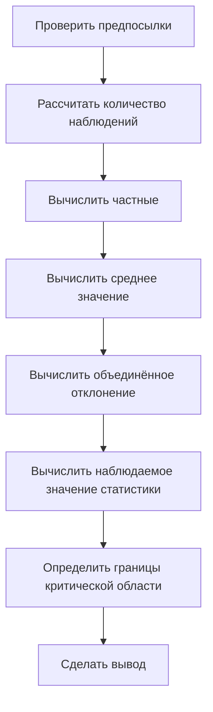

# Проверка гипотезы с помощью критерия Стьюдента с поправкой Уэлча

## Подготовительные шаги

Для проверки гипотезы о равенстве средних значений двух выборок с помощью критерия Стьюдента с поправкой Уэлча необходимо выполнить следующие шаги:



### Количество наблюдений

Для подсчёта количества наблюдений используется логическая функция `СЧЁТЕСЛИ`. Например, для подсчёта количества не спортсменов:

```
=СЧЁТЕСЛИ(диапазон, 0)
```

где `диапазон` — это диапазон ячеек, содержащих индикаторы (0 или 1), указывающие на принадлежность к группе не спортсменов или спортсменов соответственно.

Аналогично подсчитывается количество спортсменов, используя индикатор 1.


### Вычисление частных

Частное вычисляется как отношение дисперсии к количеству наблюдений. Например, для не спортсменов:

```
частное = дисперсия / количество_не_спортсменов
```

Аналогично вычисляется частное для спортсменов.

### Среднее значение

Среднее значение вычисляется с помощью функции `СРЗНАЧ`. Например, для среднего времени не спортсменов:

```
=СРЗНАЧЕСЛИ(диапазон_среднего, диапазон_условий, 0)
```

где `диапазон_среднего` — это диапазон ячеек, содержащих время, а `диапазон_условий` — диапазон ячеек, содержащих индикаторы принадлежности к группе.

Аналогично вычисляется среднее время для спортсменов.

## Объединённое отклонение

Объединённое отклонение вычисляется по формуле:

```
объединённое_отклонение = КОРЕНЬ(сумма(частное_не_спортсменов / количество_не_спортсменов, частное_спортсменов / количество_спортсменов))
```

## Наблюдаемое значение статистики

Наблюдаемое значение статистики вычисляется по формуле:

```
наблюдаемое_значение = (среднее_не_спортсменов - среднее_спортсменов) / объединённое_отклонение
```

## Границы критической области

Для определения границ критической области необходимо вычислить количество степеней свободы. В случае разных дисперсий используется формула Уэлча:

```
количество_степеней_свободы = (сумма(частное_не_спортсменов, частное_спортсменов))^2 / (частное_не_спортсменов^2 / (количество_не_спортсменов - 1) + частное_спортсменов^2 / (количество_спортсменов - 1))
```

Количество степеней свободы округляется в меньшую сторону до целого числа.

## Вывод

Если наблюдаемое значение статистики попадает в критическую область, то нулевая гипотеза о равенстве средних отвергается в пользу альтернативной гипотезы о неравенстве средних.

В этом видео мы научились проверять гипотезу, проделывая все этапы вручную, и посмотрели, как найти количество степеней свободы в случае, если у нас сильно отличаются дисперсии. В следующем видео мы рассмотрим, как можно проверить гипотезу с помощью двухвыборочного критерия Стьюдента более автоматически с помощью встроенных функций Excel, а также как построить доверительный интервал для разницы между временем у спортсменов и временем у неспортсменов.