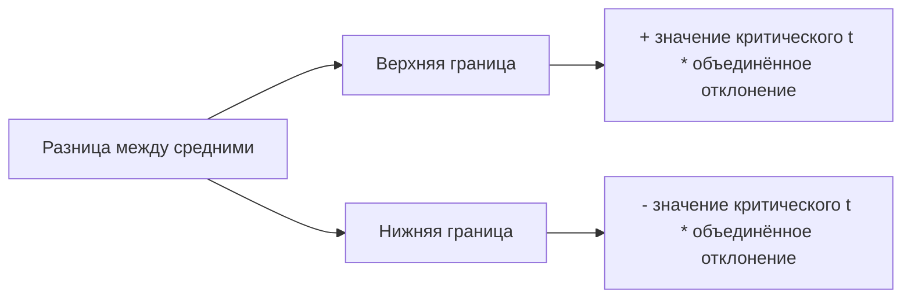

# Проверка гипотезы и построение доверительного интервала с помощью Excel

## Проверка гипотезы с помощью надстройки для анализа данных

Для проверки гипотезы с помощью двухвыборочного t-критерия Стьюдента в Excel можно использовать надстройку для анализа данных.

### Шаги для проверки гипотезы:

1. На вкладке «Данные» выбрать пункт «Анализ данных».
2. Выбрать «Двухвыборочный t-тест».
3. Выбрать «Двухвыборочный t-тест с различными дисперсиями», если известно, что дисперсии отличаются.
4. Ввести данные для первой и второй выборки.
5. Указать гипотетическую среднюю разность и уровень значимости.
6. Сохранить результаты на новый рабочий лист.


### Результаты проверки гипотезы:

После выполнения этих шагов можно сравнить полученные результаты с результатами, вычисленными вручную.

- Средние значения, дисперсии, количество наблюдений и количество степеней свободы должны совпадать с вычисленными вручную.
- Значение t-статистики также должно совпадать с вычисленным вручную.
- Если значение p-уровня очень маленькое (например, меньше 0,05), то можно сделать вывод об отвержении нулевой гипотезы в пользу альтернативной.


*Диаграмма иллюстрирует последовательность шагов для проверки гипотезы с использованием двухвыборочного t-критерия в Excel.*

## Построение доверительного интервала для разницы между средними

Для построения доверительного интервала для разницы между средним временем для спортсменов и средним временем для не спортсменов необходимо вычислить верхнюю и нижнюю границы интервала.

### Формула для вычисления верхней границы:

```
Верхняя граница = разница между средними + значение критического t * объединённое отклонение
```

### Формула для вычисления нижней границы:

```
Нижняя граница = разница между средними - значение критического t * объединённое отклонение
```

Например, если разница между средними равна 135, а значение критического t равно 1,967, то верхняя граница будет равна 152,466, а нижняя граница — 117,740. Это означает, что разница между средними находится с вероятностью 95% в интервале между 117 и 152.



*Диаграмма показывает взаимосвязь между разницей средних и границами доверительного интервала.*