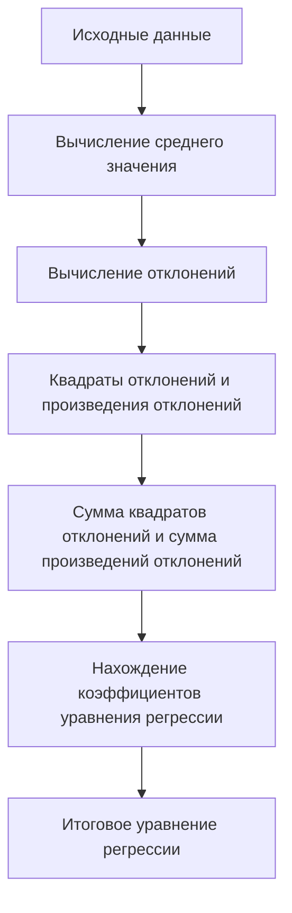

# Уравнение регрессии

## Определение и форма уравнения регрессии

В данном разделе рассматривается метод нахождения уравнения регрессии для выявления зависимости одной переменной от другой. Уравнение регрессии представляется в следующем виде:

$$
\hat{y} = bx + a
$$

где:
- $\hat{y}$ — предсказанное значение зависимой переменной,
- $x$ — значение независимой переменной,
- $b$ и $a$ — коэффициенты уравнения.

## Пример построения уравнения регрессии

Рассмотрим пример построения уравнения регрессии на основе данных о количестве часов, потраченных студентами на подготовку к экзамену, и полученных оценках.

### Исходные данные

| Количество часов ($x$) | Оценка ($y$) |
| --- | --- |
| 3 | 8 |
| 1 | 5 |
| 4 | 7 |
| 2 | 6 |
| 5 | 9 |

### Вычисление среднего значения

Для начала вычислим средние значения для $x$ и $y$:

- Среднее для $x$: $\frac{3 + 1 + 4 + 2 + 5}{5} = 3$
- Среднее для $y$: $\frac{8 + 5 + 7 + 6 + 9}{5} = 7$

### Вычисление отклонений

Далее вычислим отклонения значений $x$ и $y$ от среднего:

- Отклонения для $x$: $3 - 3 = 0$, $1 - 3 = -2$, $4 - 3 = 1$, $2 - 3 = -1$, $5 - 3 = 2$
- Отклонения для $y$: $8 - 7 = 1$, $5 - 7 = -2$, $7 - 7 = 0$, $6 - 7 = -1$, $9 - 7 = 2$

### Квадраты отклонений и произведения отклонений

Затем возводим отклонения для $x$ в квадрат и находим произведения отклонений для $x$ и $y$:

- Квадраты отклонений для $x$: $0^2 = 0$, $(-2)^2 = 4$, $1^2 = 1$, $(-1)^2 = 1$, $2^2 = 4$
- Произведения отклонений: $0 \cdot 1 = 0$, $(-2) \cdot (-2) = 4$, $1 \cdot 0 = 0$, $(-1) \cdot (-1) = 1$, $2 \cdot 2 = 4$

### Сумма квадратов отклонений и сумма произведений отклонений

Находим сумму квадратов отклонений для $x$ и сумму произведений отклонений:

- Сумма квадратов отклонений для $x$: $4 + 1 + 1 + 4 = 10$
- Сумма произведений отклонений: $4 + 1 + 4 = 9$

### Нахождение коэффициентов уравнения регрессии

Для нахождения коэффициента $b$ делим сумму произведений отклонений на сумму квадратов отклонений для $x$:

$$
b = \frac{9}{10} = 0,9
$$

Для нахождения коэффициента $a$ используем среднее значение для $y$ и найденное значение $b$:

$$
a = 7 - 0,9 \cdot 3 = 4,3
$$

### Итоговое уравнение регрессии

Таким образом, уравнение регрессии имеет вид:

$$
\hat{y} = 0,9x + 4,3
```

### Диаграмма процесса построения уравнения регрессии



Диаграмма иллюстрирует последовательность шагов для построения уравнения регрессии, начиная с исходных данных и заканчивая итоговым уравнением.