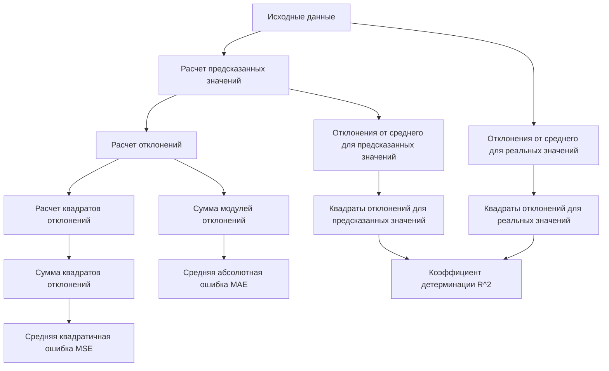

# Оценка качества уравнения регрессии

## Введение

В данном разделе рассматривается методика оценки качества построенного уравнения регрессии на примере данных о количестве часов, потраченных студентами на подготовку, и их оценках за экзамен.

## Метрики качества регрессии

Для оценки качества регрессии используются несколько метрик:

### Средняя квадратичная ошибка (MSE)

1. **Расчет предсказанных значений:**
   - Используем уравнение регрессии: $\hat{y} = 0,9x + 4,3$.
   - Для $x = 3$: $\hat{y} = 0,9 \times 3 + 4,3 = 7$.
   - Для $x = 1$: $\hat{y} = 0,9 \times 1 + 4,3 = 5,2$.
   - Для $x = 4$: $\hat{y} = 0,9 \times 4 + 4,3 = 7,9$.
   - Для $x = 2$: $\hat{y} = 0,9 \times 2 + 4,3 = 6,1$.
   - Для $x = 5$: $\hat{y} = 0,9 \times 5 + 4,3 = 8,8$.

2. **Расчет отклонений:**
   - Отклонения: $8 - 7 = 1$, $5 - 5,2 = -0,2$, $7 - 7,9 = -0,9$, $6 - 6,1 = -0,1$, $9 - 8,8 = 0,2$.

3. **Расчет квадратов отклонений:**
   - Квадраты отклонений: $1^2 = 1$, $(-0,2)^2 = 0,04$, $(-0,9)^2 = 0,81$, $(-0,1)^2 = 0,01$, $(0,2)^2 = 0,04$.

4. **Сумма квадратов отклонений:** $1 + 0,04 + 0,81 + 0,01 + 0,04 = 1,9$.

5. **Средняя квадратичная ошибка:** $MSE = \frac{1,9}{5} = 0,38$.

6. **Корень из MSE:** $\sqrt{MSE} \approx 0,616$.

### Средняя абсолютная ошибка (MAE)

1. **Сумма модулей ошибок:** $1 + 0,2 + 0,9 + 0,1 + 0,2 = 2,4$.

2. **Средняя абсолютная ошибка:** $MAE = \frac{2,4}{5} = 0,48$.

### Коэффициент детерминации ($R^2$)

1. **Отклонения от среднего для реальных значений:**
   - Среднее значение: $7$.
   - Отклонения: $8 - 7 = 1$, $5 - 7 = -2$, $7 - 7 = 0$, $6 - 7 = -1$, $9 - 7 = 2$.

2. **Квадраты отклонений для реальных значений:** $1^2 + (-2)^2 + 0^2 + (-1)^2 + 2^2 = 10$.

3. **Отклонения от среднего для предсказанных значений:**
   - Отклонения: $7 - 7 = 0$, $5,2 - 7 = -1,8$, $7,9 - 7 = 0,9$, $6,1 - 7 = -0,9$, $8,8 - 7 = 1,8$.

4. **Квадраты отклонений для предсказанных значений:** $0^2 + (-1,8)^2 + 0,9^2 + (-0,9)^2 + 1,8^2 = 8,1$.

5. **Коэффициент детерминации:** $R^2 = \frac{8,1}{10} = 0,81$.

## Схема расчета метрик

*Схема иллюстрирует последовательность расчета основных метрик качества регрессии.*

## Заключение

В данном видео были рассчитаны все основные метрики для оценки качества регрессии. Теперь вы можете для любого регрессионного уравнения оценить, насколько хорошо оно предсказывает ваши данные.