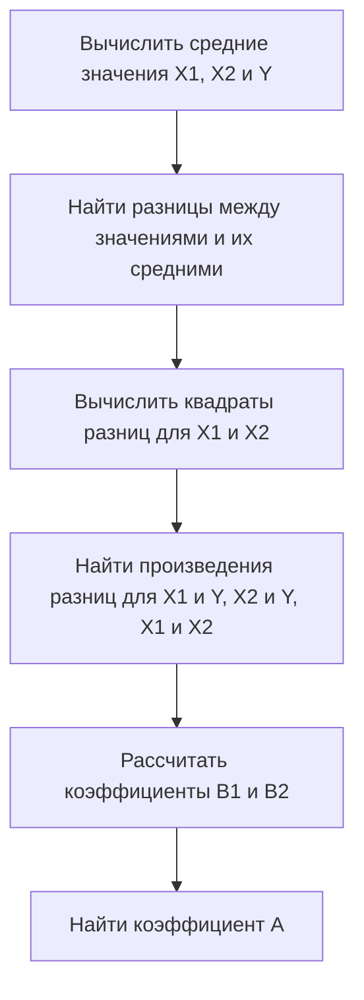

# Множественная линейная регрессия

## Определение

Множественная линейная регрессия — это метод, позволяющий предсказать значение зависимой переменной на основе нескольких независимых переменных. В данном случае рассматривается предсказание оценки студента ($Y$) на основе количества часов, потраченных на подготовку к экзамену ($X_1$), и количества часов сна перед экзаменом ($X_2$).

## Данные

Пусть:
- $X_1$ — количество часов, потраченных на подготовку;
- $X_2$ — количество часов сна перед экзаменом;
- $Y$ — оценка.

Имеются следующие данные:

- $X_1$: 3, 1, 4, 2, 5;
- $X_2$: 7, 3, 6, 5, 9;
- $Y$: 8, 5, 7, 6, 9.

## Уравнение множественной линейной регрессии

Уравнение множественной линейной регрессии имеет вид:

$$
\hat{Y} = B_1 \cdot X_1 + B_2 \cdot X_2 + A
$$

## Вычисление коэффициентов

Для нахождения коэффициентов $B_1$, $B_2$ и $A$ необходимо выполнить следующие шаги:



1. Вычислить средние значения для $X_1$, $X_2$ и $Y$.
2. Найти разницы между значениями $X_1$, $X_2$ и $Y$ и их средними значениями.
3. Вычислить квадраты разниц для $X_1$ и $X_2$.
4. Найти произведения разниц для $X_1$ и $Y$, $X_2$ и $Y$, а также $X_1$ и $X_2$.
5. Рассчитать коэффициенты $B_1$ и $B_2$ по формулам:

$$
B_1 = \frac{9 \cdot 20 - 13 \cdot 14}{10 \cdot 20 - 13^2} \approx -0,65
$$

$$
B_2 = \frac{14 \cdot 10 - 13 \cdot 9}{31} \approx 0,742
$$

6. Найти коэффициент $A$ по формуле:

$$
A = \bar{Y} - B_1 \cdot \bar{X_1} - B_2 \cdot \bar{X_2} \approx 2,743
$$

## Итоговые коэффициенты

- $B_1 \approx -0,65$;
- $B_2 \approx 0,742$;
- $A \approx 2,743$.

## Уравнение множественной линейной регрессии

$$
\hat{Y} = -0,65 \cdot X_1 + 0,742 \cdot X_2 + 2,743
```

### Взаимосвязи между переменными


Диаграмма выше иллюстрирует взаимосвязь между независимыми переменными ($X_1$ и $X_2$) и зависимой переменной ($Y$).

