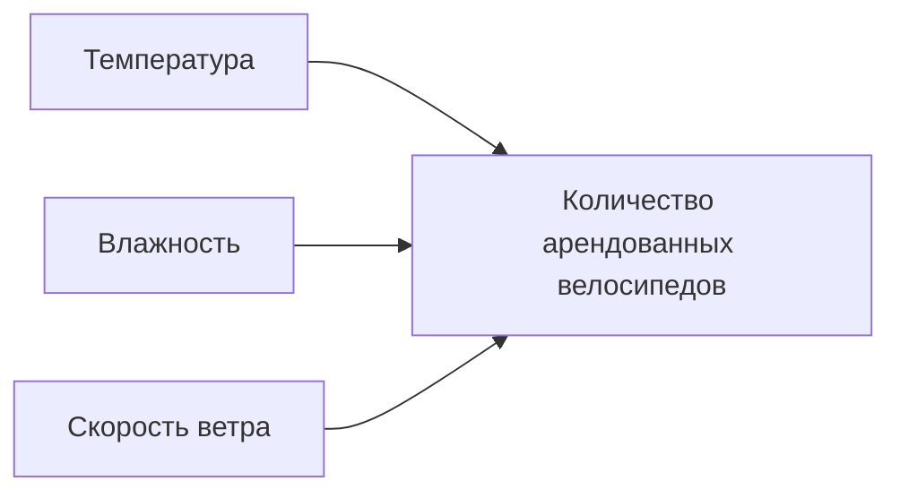
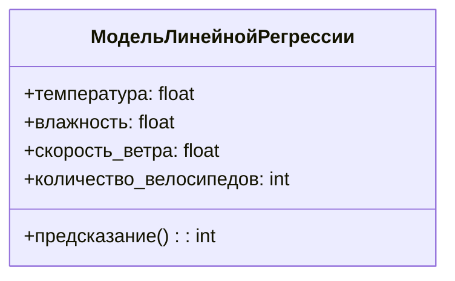

# Расчёт линейной регрессии в Python

## Импорт библиотек и загрузка данных

Для анализа данных и построения модели линейной регрессии используются следующие библиотеки:

- pandas;
- seaborn;
- matplotlib;
- statsmodels;
- numpy.

Данные для анализа представляют собой набор информации о прокате велосипедов, включая количество арендованных велосипедов, среднюю температуру, влажность и скорость ветра за каждую неделю года.

## Проверка предпосылок для построения модели

Перед построением модели линейной регрессии необходимо проверить следующие предпосылки:

1. **Отсутствие мультиколлинеарности** — переменные между собой не должны коррелировать.
2. **Наличие линейной зависимости** — между зависимой переменной и независимыми предикторами должна быть линейная зависимость.

### Проверка мультиколлинеарности

Для проверки мультиколлинеарности строится *тепловая карта* корреляции между переменными. В данном случае наблюдается сильная корреляция только между температурой и количеством арендованных велосипедов.

*Диаграмма выше иллюстрирует основные корреляции между переменными.*

### Проверка линейной зависимости

Для проверки линейной зависимости строятся *парные графики рассеяния* между зависимой переменной и каждым из независимых предикторов. В данном случае наблюдается линейная зависимость между количеством арендованных велосипедов и температурой.

## Построение модели линейной регрессии

Для построения модели линейной регрессии используются функции из библиотеки *statsmodels*. Сначала строится модель с одним предиктором (температурой), затем — с тремя предикторами (температурой, влажностью и скоростью ветра).

### Модель с одним предиктором

Модель строится с использованием функции *OLS* из библиотеки *statsmodels*. В качестве независимого предиктора используется температура.

Результаты модели:

- коэффициент наклона: 439;
- значение коэффициента при температуре: 439 (количество арендованных велосипедов увеличивается на 439 при увеличении температуры на 1 градус);
- значение R²: 0,71 (модель объясняет 71% дисперсии в целевой переменной).

### Модель с несколькими предикторами

Модель строится с использованием функции *OLS* из библиотеки *statsmodels*. В качестве независимых предикторов используются температура, влажность и скорость ветра.

*Диаграмма выше показывает структуру модели линейной регрессии с несколькими предикторами.*

## Визуализация результатов

Для визуализации результатов строится график рассеяния с линией регрессии. На графике отображаются оригинальные данные и линия регрессии, предсказывающая количество арендованных велосипедов на основе температуры.

*Диаграмма выше иллюстрирует процесс визуализации результатов регрессии.*