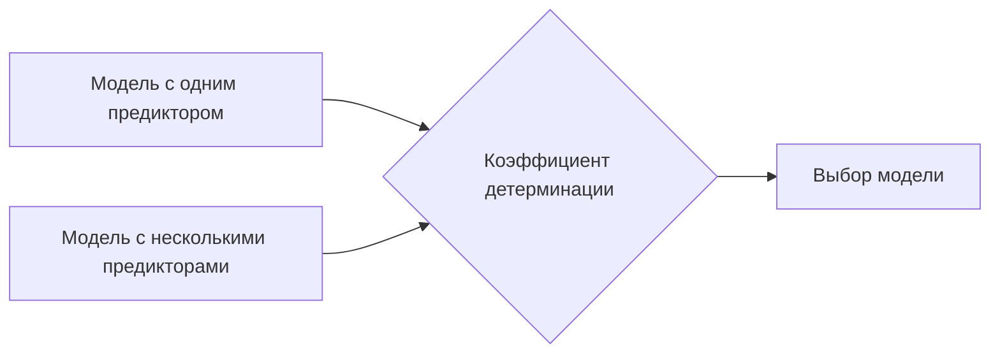

# Построение линейной регрессии с использованием библиотеки StatsModels

## Подготовка данных и построение модели с одним предиктором

Для построения линейной регрессии с помощью библиотеки *StatsModels* необходимо выполнить следующие шаги:

1. Задать переменные:
   - $x$ — предиктор (например, температура);
   - $y$ — зависимая переменная (например, количество арендованных велосипедов).

2. Импортировать библиотеку *StatsModels*:
   ```python
   import statsmodels.api as sm
   ```

3. Использовать метод *OLS* (Ordinary Least Squares) для построения модели:
   ```python
   model = sm.OLS(y, x).fit()
   ```

4. Распечатать результаты:
   ```python
   print(model.summary())
   ```

### Особенности построения модели

- В *StatsModels* порядок передачи переменных отличается от *SciPy*: сначала передаётся $y$, затем $x$.
- Для получения свободного члена (Intercept) необходимо добавить в $x$ константу — колонку, заполненную единицами.


## Построение модели с несколькими предикторами (многомерная регрессия)

Для построения многомерной линейной регрессии необходимо выполнить следующие шаги:

1. Задать матрицу предикторов $X$:
   - включить все независимые переменные, кроме зависимой.

2. Добавить константу в $X$:
   - можно добавить новую колонку, полностью состоящую из единиц.

3. Построить модель:
   ```python
   model = sm.OLS(y, X).fit()
   ```

4. Просмотреть результаты:
   ```python
   print(model.summary())
   ```

### Интерпретация результатов

- **Коэффициент детерминации** ($R^2$) показывает, насколько хорошо модель объясняет вариацию зависимой переменной.
- **Статистическая значимость коэффициентов** определяется по уровню $p$-значения. Если $p$-значение меньше выбранного уровня значимости (например, 0,05), то коэффициент считается статистически значимым.

## Сравнение моделей



- Модель с несколькими предикторами может иметь более высокий коэффициент детерминации по сравнению с моделью с одним предиктором. Однако введение новых переменных не всегда значительно улучшает модель.

- Важно учитывать статистическую значимость коэффициентов при интерпретации результатов.

## Заключение

В ходе лекции были рассмотрены основные шаги по построению линейной регрессии с использованием библиотеки *StatsModels*. Были изучены особенности построения моделей с одним и несколькими предикторами, а также интерпретация результатов.