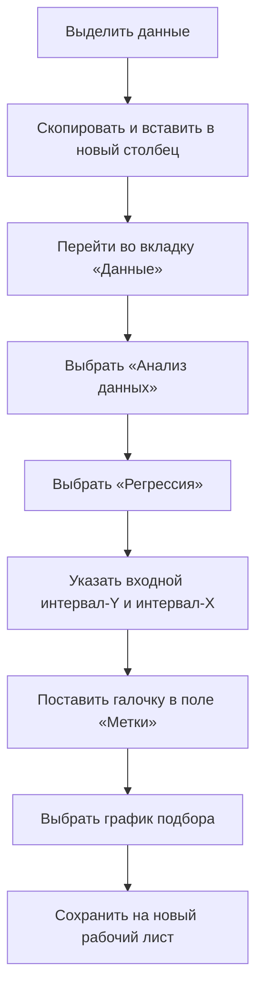
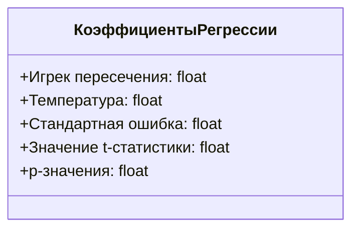

# Построение уравнения линейной регрессии для предсказания количества арендованных велосипедов

## Область применения

В данном материале рассматривается метод линейной регрессии для прогнозирования общего количества арендованных велосипедов в зависимости от средней температуры.

## Подготовка данных

Для построения уравнения линейной регрессии необходимо подготовить данные, сгруппированные по неделям. Для этого используется сводная таблица:

1. Выделить все столбцы.
2. Перейти на вкладку «Вставка» и выбрать пункт «Сводная таблица».
3. Перетащить даты в строки для группировки по неделям.
4. Добавить суммарное количество аренд и температуру в поле значений.

## Группировка данных

Изменить группировку на более удобную:

1. Нажать на «Группировать» и выбрать «Группировать по количеству дней — семь».

Теперь у нас есть группировка за каждые семь дней.

## Вычисление необходимых значений

Для температуры заменить количество на среднее, чтобы получить среднее значение температуры за неделю. Для количества аренд подсчитать суммарное количество за каждую неделю.

## Построение регрессионной модели

1. Выделить полученные данные, скопировать их и вставить в новый столбец.
2. Перейти во вкладку «Данные» и выбрать пункт «Анализ данных».
3. В меню «Анализ данных» выбрать пункт «Регрессия».
4. Указать входной интервал-Y (количество аренд) и входной интервал-X (температура).
5. Поставить галочку в поле «Метки», чтобы отметить, что в первых строчках находятся заголовки для столбцов.
6. Выбрать график подбора и сохранить на новый рабочий лист.

## Результаты регрессионного анализа

### Основная регрессионная статистика

- **Множественное значение R** — коэффициент множественной корреляции.
- **R-квадрат** — коэффициент детерминации, показывающий, какой процент разброса значений можно объяснить с помощью модели.
- **Нормированные значения R-квадрат** — скорректированный коэффициент детерминации с поправкой на число степеней свободы.
- **Стандартная ошибка регрессии** — мера точности модели.
- **Количество наблюдений** — количество точек данных.

### Дисперсионный анализ

Результаты дисперсионного анализа показывают значимость модели в целом.

### Коэффициенты регрессии

- **Игрек пересечения** — коэффициент A в уравнении регрессии.
- **Температура** — коэффициент B в уравнении регрессии.
- **Стандартная ошибка** — мера точности оценки коэффициентов.
- **Значение t-статистики** — расчётные значения критерия, которые вычисляются по формуле: коэффициент разделить на стандартную ошибку.
- **p-значения** — вероятность ошибки при принятии гипотезы о значимости коэффициента. Если p-значение меньше уровня значимости, то коэффициент статистически значим.

### Границы доверительных интервалов

Границы 95% доверительных интервалов для коэффициентов уравнений линейной регрессии показывают диапазон значений, в котором с вероятностью 95% находится истинное значение коэффициента.

## График подбора

График подбора иллюстрирует, насколько реальные значения отличаются от предсказанных моделью. Предсказанные значения идут по одной линии, так как мы делаем предсказание с помощью линейной модели.