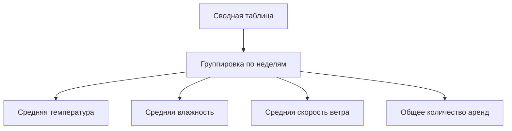
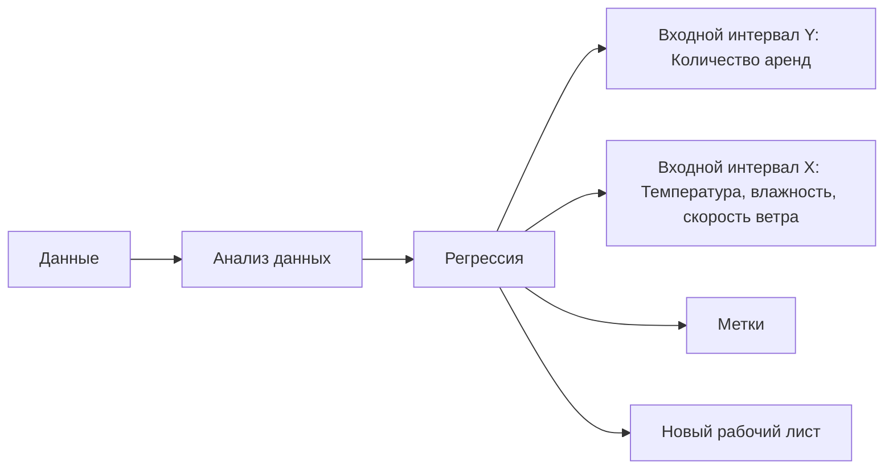

# Множественная линейная регрессия

## Подготовка данных

Для построения уравнения множественной линейной регрессии необходимо подготовить данные. В качестве примера используется сводная таблица, сгруппированная по неделям.

1. **Создаём сводную таблицу:**
   - Выделяем все столбцы с данными.
   - Добавляем сводную таблицу.
   - Даты должны идти по строчкам.
   - В качестве значений добавляем температуру, влажность и скорость ветра.
   - Также добавляем общее количество аренд.

2. **Изменяем группировку:**
   - Нажимаем правой клавишей на один из годов.
   - Выбираем пункт «Группировать».
   - Выбираем количество дней — семь.

Теперь у нас есть группировка по неделям.

## Расчёт необходимых значений

Для расчёта линейной регрессии нам понадобятся следующие значения:
- средняя температура;
- средняя скорость ветра;
- средняя влажность;
- общее количество аренд.

Для этого заменяем количество на среднее для температуры, влажности и скорости ветра, а для количества аренд — на сумму.




## Построение уравнения множественной регрессии

1. Идём во вкладку «Данные».
2. Выбираем пункт «Анализ данных».
3. Выбираем «Регрессия».
4. В «Входной интервал Y» добавляем количество аренд — то, что мы будем предсказывать.
5. В «Входной интервал X» добавляем температуру, влажность и скорость ветра.
6. Оставляем галочку в поле «Метки», так как в первой строчке находятся названия признаков.
7. Убираем галочку с «Графиком подбора», так как у нас множественная регрессия.
8. Добавляем на новый рабочий лист.



## Анализ результатов

Коэффициент детерминации изменился по сравнению с простой моделью. Теперь он равен примерно 73%. Это значение немного больше, чем в случае с простой регрессией.

Также мы получили коэффициенты для Y-пересечения, температуры, влажности и скорости ветра. Однако не все коэффициенты статистически значимы:
- Коэффициент Y-пересечения статистически значим.
- Температура также статистически значима.
- Влажность находится на пограничной позиции.
- Скорость ветра — незначимый коэффициент.

На этом примере можно сделать вывод, что модель множественной регрессии не сильно улучшилась по сравнению с простой моделью. Возможно, модель множественной регрессии не намного лучше, чем модель простой регрессии, которую мы строили ранее.

```mermaid
graph LR
    A[Множественная регрессия] --> B[Коэффициент детерминации: 73%]
    B --> C[Y-пересечение: значимо]
    B --> D[Температура: значима]
    B --> E[Влажность: погранично]
    B --> F[Скорость ветра: незначима]