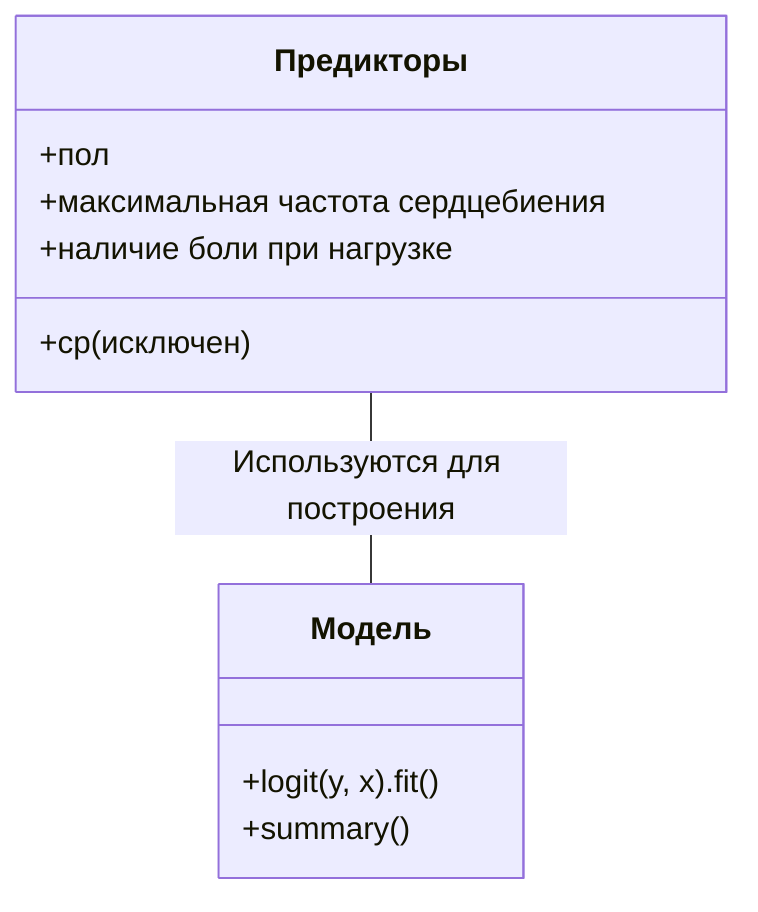
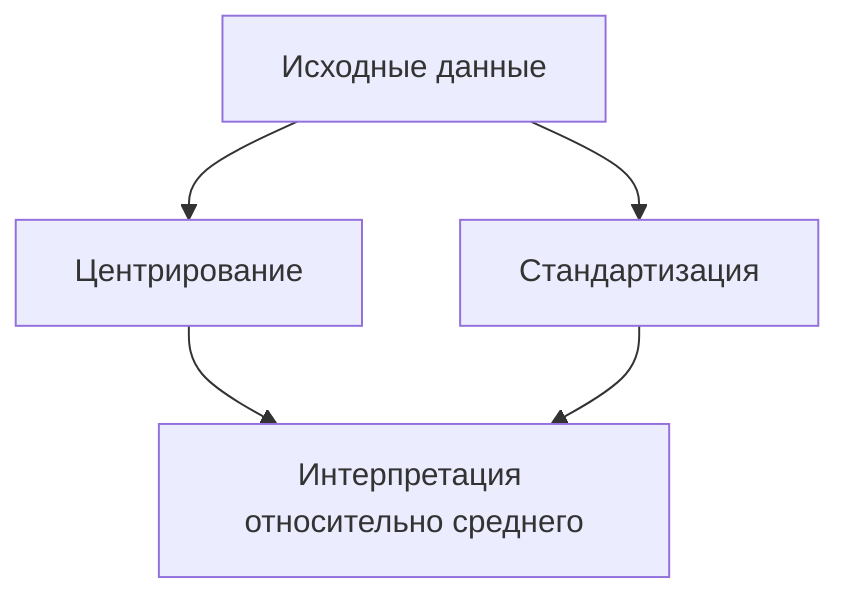

# Логистическая регрессия

## Подготовка данных и импорт библиотек

Для работы с логистической регрессией необходимо импортировать следующие библиотеки:

- `pandas`;
- `statsmodels`;
- `numpy`.

Далее необходимо загрузить датасет, например, про сердечно-сосудистые заболевания.

## Простая логистическая регрессия с одним предиктором

Для начала можно построить модель логистической регрессии с одним предиктором, например, с переменной «пол». В качестве целевой переменной используется переменная `target`, обозначающая наличие или отсутствие сердечно-сосудистого заболевания.

Для построения модели используется функция `logit` из библиотеки `statsmodels`.

```python
result = logit(y, x).fit()
print(result.summary())
```

В результате получаем коэффициенты модели, которые можно интерпретировать как логарифм шансов.

### Интерпретация коэффициентов

Коэффициенты логистической регрессии интерпретируются как логарифм отношения вероятности наступления события к вероятности его ненаступления. Для интерпретации коэффициентов необходимо их экспонировать.

Например, если коэффициент при переменной «пол» равен -1,32, то это означает, что шанс диагностирования сердечно-сосудистого заболевания у мужчин в 3 раза меньше, чем у женщин.


## Логистическая регрессия с несколькими предикторами

Далее можно построить модель логистической регрессии с несколькими предикторами. Например, можно использовать все переменные, кроме `cp` (тип боли в груди), так как эта переменная является порядковой и её лучше преобразовать в бинарную.

```python
result = logit(y, x).fit()
print(result.summary())
```

В результате получаем коэффициенты модели для каждой переменной. Из них статистически значимыми являются только три: «пол», «максимально зафиксированная частота сердцебиения» и «наличие боли в результате физической нагрузки».



## Стандартизация и центрирование

Для интерпретации коэффициентов модели можно применить стандартизацию и центрирование переменных. Стандартизация заключается в вычитании среднего значения из каждой переменной и делении на стандартное отклонение. Центрирование заключается в вычитании среднего значения из каждой переменной.

После стандартизации и центрирования переменные интерпретируются не относительно нуля, а относительно среднего значения или стандартного отклонения.



## Заключение

В ходе лекции были рассмотрены следующие аспекты логистической регрессии:

- построение простой модели с одним предиктором;
- интерпретация коэффициентов модели;
- построение модели с несколькими предикторами;
- стандартизация и центрирование переменных.

