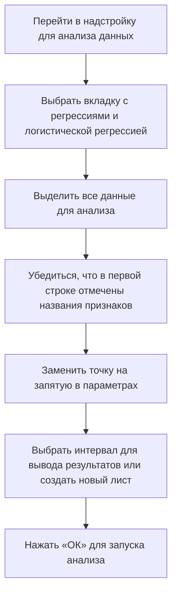

# Логистическая регрессия с несколькими предикторами

## Подготовка данных

Для построения логистической регрессии с несколькими предикторами необходимо подготовить данные:

- Выбрать переменные-предикторы, исключая целевую переменную и переменную Cp с сложной кодировкой.
- Преобразовать данные в числовой формат.

## Построение модели

Процесс построения модели включает следующие шаги:

## Анализ результатов

### Коэффициент псевдо-R²

Коэффициент псевдо-R² увеличился по сравнению с предыдущей моделью, что указывает на улучшение качества модели.

### Значимые коэффициенты

Из коэффициентов модели значимыми являются только три:

- Пол.
- Максимально зафиксированная частота сердечных сокращений.
- Наличие стенокардии во время физической нагрузки.

### Интерпретация коэффициентов

Для интерпретации коэффициентов необходимо преобразовать их в шансы с помощью экспоненты:

- Принадлежность к мужскому полу (единица) уменьшает шансы на наличие сердечно-сосудистого заболевания примерно в 5 раз.
- Увеличение частоты сердечных сокращений на единицу незначительно повышает шансы на заболевание.
- Наличие боли в результате физической нагрузки (единица) понижает шансы на заболевание, что может указывать на перенапряжение, а не на болезнь.

## Модель для количественных переменных

Для построения модели только для количественных переменных необходимо удалить все категориальные переменные. Затем повторить процесс построения модели и анализа результатов.

При интерпретации результатов возникает проблема с интерпретацией свободного члена, так как предполагается, что все предиторы равны нулю, что нелогично для реальных данных. Для решения этой проблемы можно центрировать данные.

## Заключение

В данном видео мы рассмотрели, как построить модель множественной логистической регрессии, сравнили её качество с качеством логистической регрессии с одним предиктором и научились интерпретировать полученные коэффициенты.