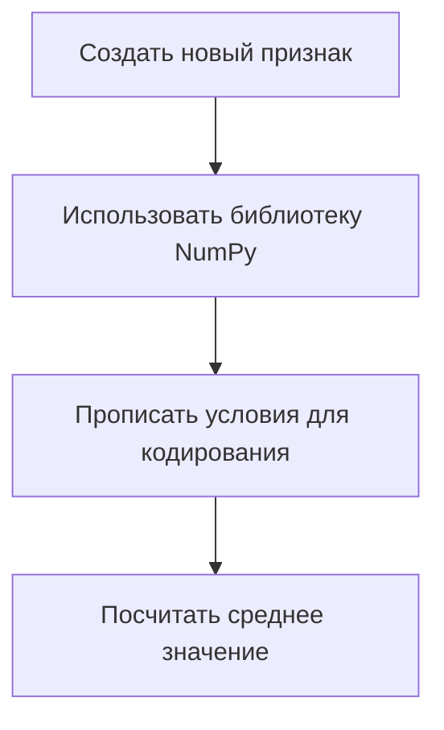
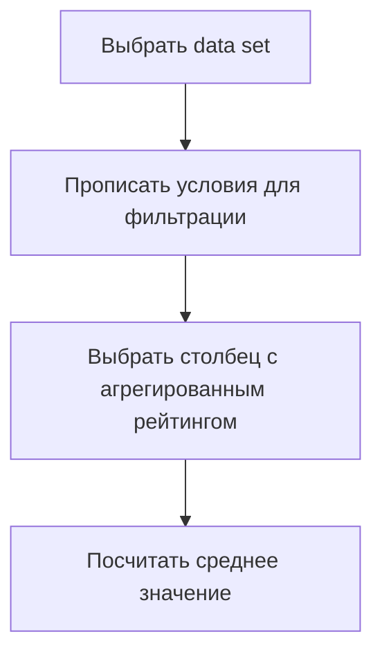

# Обработка данных: решение задач с использованием функций и библиотек

## Определение наиболее часто встречающегося жанра игр

Для определения наиболее часто встречающегося жанра игр в наборе данных DF необходимо применить функцию, которая вычисляет частоты для всех жанров. Функция `value_counts()` позволяет это сделать.

1. Применить функцию `value_counts()` к колонке с жанрами.
2. Выбрать жанр с наибольшей частотой.

Пример:
- Определить наиболее часто встречающийся жанр игр.
- Использовать функцию `value_counts()` для подсчета частот.
- Выбрать жанр с максимальной частотой (например, «экшен»).

## Добавление нового признака и вычисление среднего значения

Для добавления в таблицу нового признака, представляющего собой закодированное название платформы для запуска игры, необходимо выполнить следующие шаги:

1. Создать новый признак с использованием библиотеки NumPy и Functionware.
2. Прописать условия для кодирования платформы: если платформа — PlayStation 3 (PS3), то код равен 1, иначе — 0.
3. Посчитать среднее значение по новому признаку.

Пример:
- Создать новый признак «платформ_код».
- Использовать библиотеку NumPy для создания условия.
- Посчитать среднее значение по колонке «платформ_код» (например, 0,08).

## Вычисление среднего агрегированного рейтинга Metacritic

Для вычисления среднего агрегированного рейтинга Metacritic для игр, выпущенных двумя компаниями, необходимо выполнить следующие действия:

1. Выбрать data set и прописать два условия для фильтрации данных: либо компания 1 выпустило игру, либо компания 2.
2. Выбрать столбец с агрегированным рейтингом критиков.
3. Посчитать среднее значение по отфильтрованным данным.

Пример:
- Выбрать data set и прописать условия для фильтрации.
- Выбрать столбец с агрегированным рейтингом.
- Посчитать среднее значение (например, 65,60).