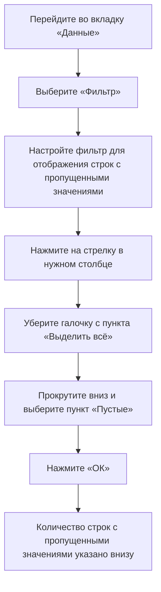
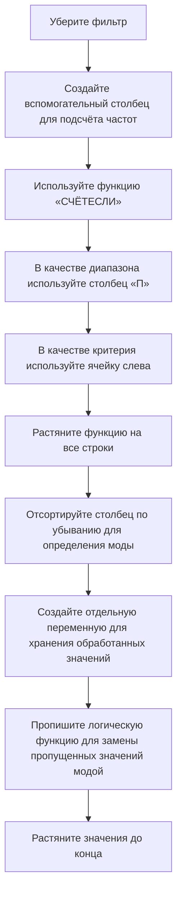
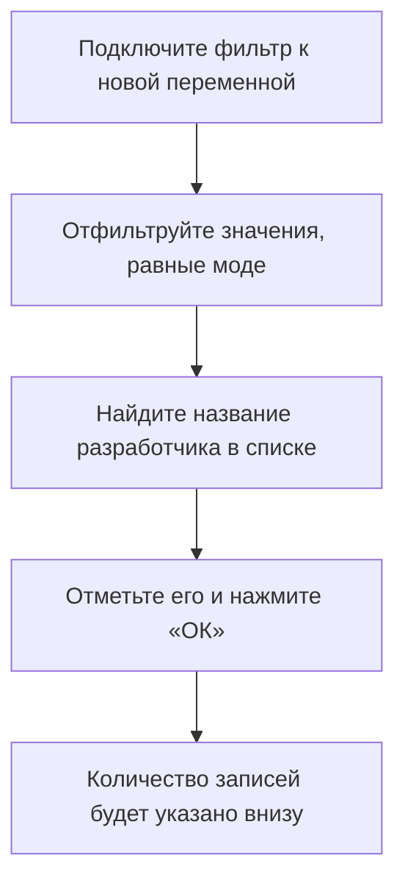

# Обработка пропущенных значений в данных

## Определение и подсчёт пропущенных значений

Для анализа данных важно уметь определять наличие и количество пропущенных значений. Это необходимо для корректной обработки данных и предотвращения ошибок в анализе.

### Процесс определения и подсчёта пропущенных значений

Пример: если в столбце «П» содержится информация о разработчиках игр, и вы хотите определить количество пропущенных значений, выполните описанные выше шаги. Предположим, что количество строк с пропущенными значениями равно 62 623. Это и будет ответом на задание.

## Обработка пропущенных значений

После определения количества пропущенных значений необходимо обработать их. В данном случае предлагается заменить пропущенные значения модой по признаку.

### Процесс обработки пропущенных значений

Пример: если самое часто встречающееся значение — «Ubisoft», то все пропущенные значения в столбце «П» будут заменены на «Ubisoft».

## Подсчёт количества значений, равных моде

После замены пропущенных значений модой необходимо подсчитать количество значений, равных моде.

### Процесс подсчёта значений, равных моде

Пример: если количество записей равно 6 827, то это и будет ответом на задание.

## Заключение

В этом видео мы вспомнили, как определить наличие и количество пропущенных значений в данных, а также как заполнить пропущенные значения модой признака. В следующем видео мы рассмотрим, как строить различные диаграммы в Excel и делать выводы по полученной визуализации.