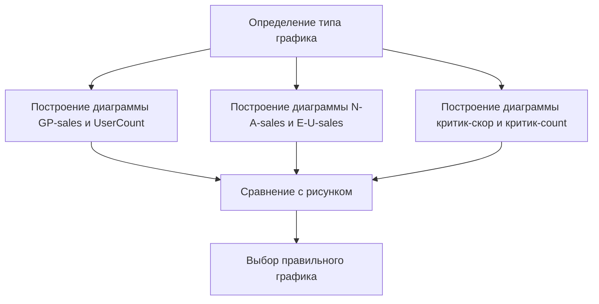

# Визуализация данных в Excel

## Построение диаграммы рассеяния

Для анализа взаимосвязи между двумя переменными можно использовать диаграмму рассеяния. Рассмотрим пример построения диаграммы для переменных *критик-скор* и *продажи по Евросоюзу*.

1. Скопируйте данные по количеству продаж по Евросоюзу и рейтингу критиков в отдельные столбцы.
2. Расположите рейтинг критиков слева, а количество продаж — справа.
3. Выделите два столбца с данными.
4. Перейдите в меню *Вставка* и выберите *Точечная диаграмма*.

Диаграмма выше иллюстрирует процесс построения диаграммы рассеяния в Excel.

## Анализ диаграммы рассеяния

После построения диаграммы можно сделать следующие выводы:

- **Выбросы**: на диаграмме можно увидеть точки, которые значительно отличаются от остальных. Это могут быть выбросы.
- **Взаимосвязь между переменными**: нельзя делать выводы о влиянии одной переменной на другую на основе диаграммы рассеяния. Для этого нужны другие методы анализа данных.
- **Линейная взаимосвязь**: если точки на диаграмме выстраиваются в линию, можно говорить о наличии линейной взаимосвязи между переменными.

### Примеры утверждений

1. Построенная диаграмма показывает, что в выборке возможно есть выбросы. — **Верно**.
2. Изменение переменной *критик-скор* совершенно не влияет на изменение переменной *Yale Sales*. — **Неверно**.
3. Между переменными *критик-скор* и *Yale Sales* существует сильная положительная линейная взаимосвязь. — **Неверно**.
4. Между переменными *критик-скор* и *Yale Sales* существует сильная отрицательная линейная взаимосвязь. — **Неверно**.

## Определение типа графика

В следующем задании необходимо определить, какой график изображён на рисунке. Предлагаются четыре варианта ответа:

1. Диаграмма рассеяния переменных *GP-sales* и *UserCount*.
2. Гистограмма переменной *UserCount*.
3. Диаграмма рассеяния переменных *N-A-sales* и *E-U-sales*.
4. Диаграмма рассеяния переменных *критик-скор* и *критик-count*.

Для определения правильного ответа необходимо построить все три диаграммы рассеяния и сравнить их с предложенным рисунком.

### Построение диаграмм

1. Диаграмма для переменных *GP-sales* и *UserCount*: выделите нужные столбцы, перейдите в меню *Вставка* и выберите *Точечная диаграмма*.
2. Диаграмма для переменных *N-A-sales* и *E-U-sales*: выделите нужные столбцы, перейдите в меню *Вставка* и выберите *Точечная диаграмма*.
3. Диаграмма для переменных *критик-скор* и *критик-count*: выделите нужные столбцы, перейдите в меню *Вставка* и выберите *Точечная диаграмма*.

После построения диаграмм можно сделать вывод, что нужная диаграмма — это диаграмма для переменных *N-A-sales* и *E-U-sales*.

Диаграмма выше показывает процесс определения типа графика на основе построения и сравнения диаграмм.

## Заключение

В этом видео мы кратко вспомнили, как строить диаграммы в Excel, а также как по полученной визуализации можно сделать содержательные выводы. Следующим шагом будет изучение расчёта коэффициентов корреляции и построения модели линейной регрессии.