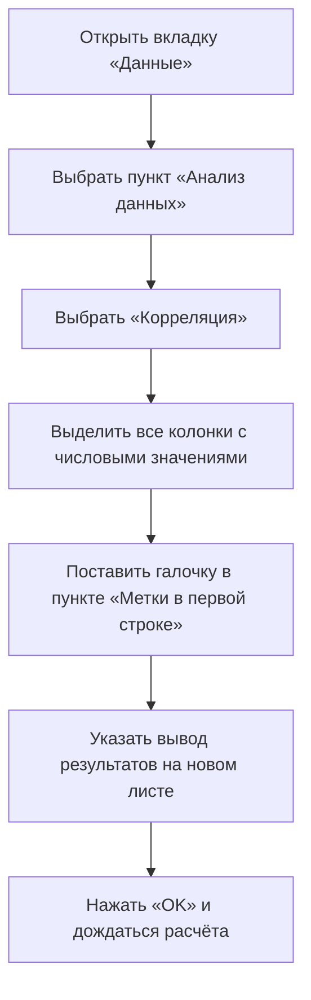
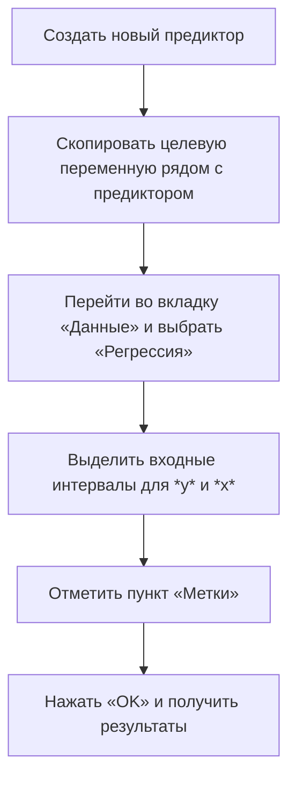

# Обработка данных и анализ: корреляция и линейная регрессия

## Построение корреляционной матрицы

Для анализа взаимосвязи между числовыми переменными используется **корреляционная матрица**. Для её построения в программе Excel необходимо выполнить следующие шаги:

После построения матрицы корреляции можно найти переменную, которая имеет наибольшую по модулю корреляцию с заданной переменной.

## Пример задачи на корреляцию

**Задача:** построить корреляционную матрицу для числовых переменных и найти переменную, которая имеет наибольшую по модулю корреляцию с переменной *Yale Sales*.

**Решение:**

1. Построить корреляционную матрицу, как описано выше.
2. Найти столбец с переменной *Yale Sales*.
3. Определить наибольшее значение в этом столбце.
4. Выписать модуль этого значения в качестве ответа.

## Построение линейной регрессии

**Линейная регрессия** — это метод анализа данных, который позволяет оценить взаимосвязь между зависимой переменной и одной или несколькими независимыми переменными. Для построения простой линейной регрессии с одним предиктором необходимо выполнить следующие шаги:

## Пример задачи на линейную регрессию

**Задача:** построить простую линейную регрессию с одним предиктором и оценить коэффициент детерминации (*R²*).

**Решение:**

1. Создать новый предиктор, как описано выше.
2. Скопировать целевую переменную рядом с новым предиктором.
3. Построить модель линейной регрессии, как описано выше.
4. Найти коэффициент детерминации (*R²*) в результатах модели.

Таким образом, мы разобрали весь вариант, повторили всё, что прошли в течение курса, и готовы к экзамену по статистике для анализа данных.